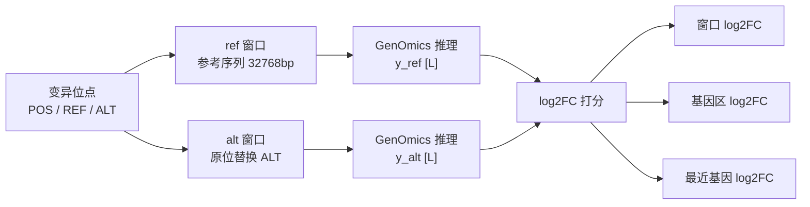
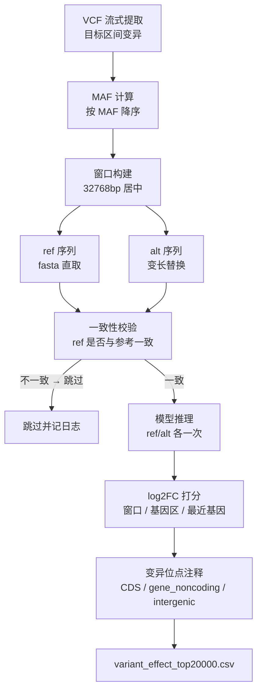
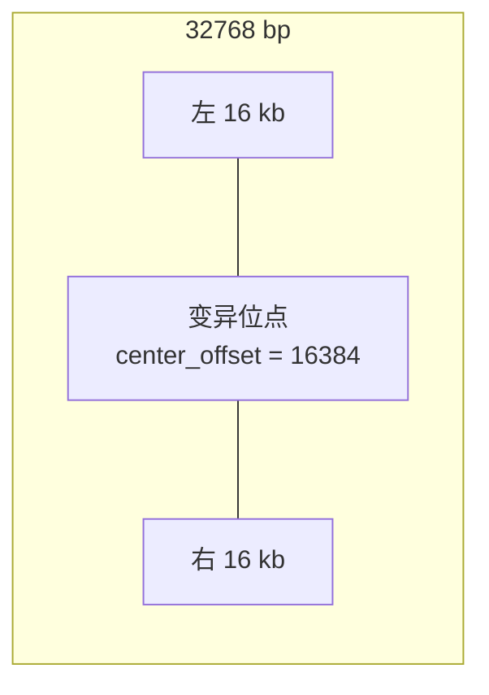
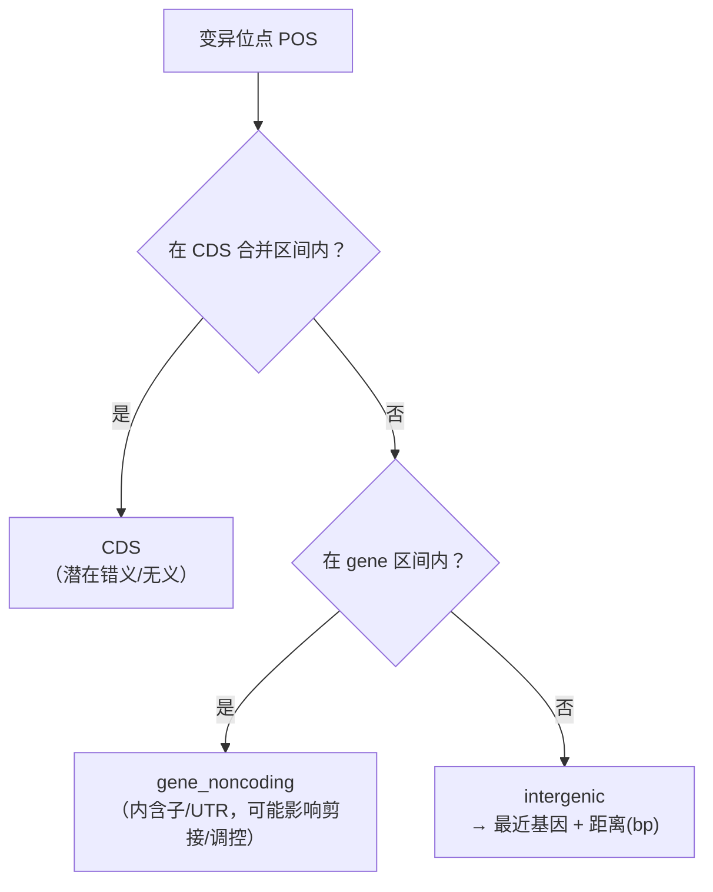
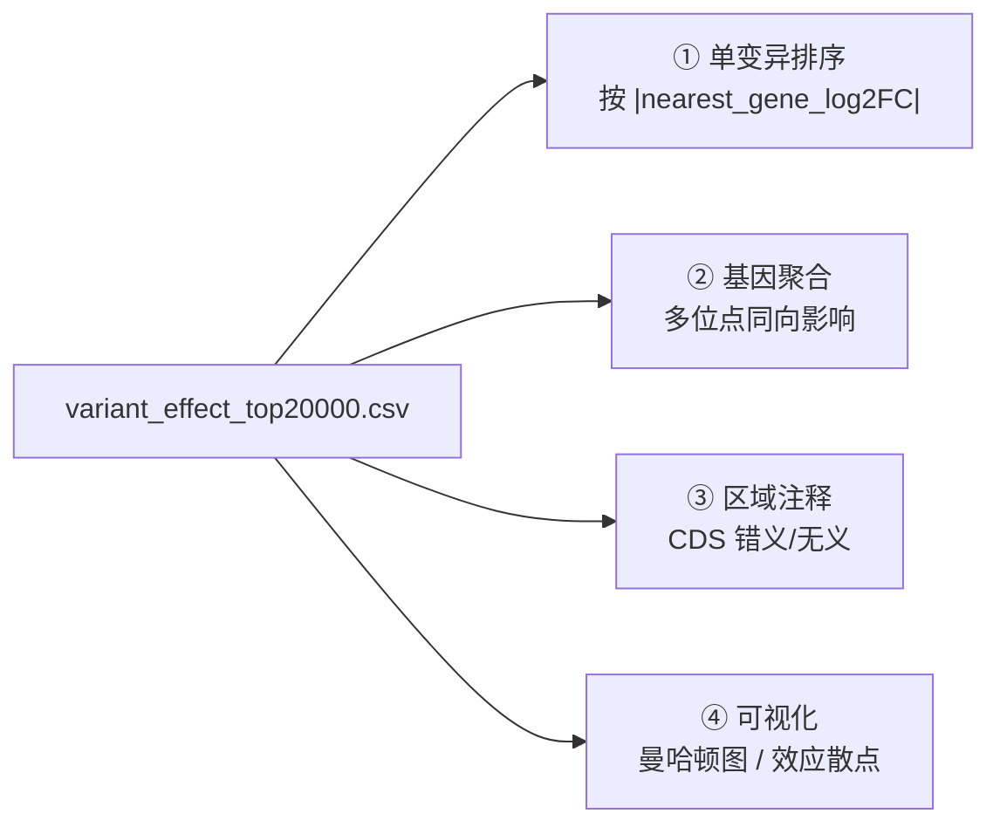

# 变异效应推理打分方法（Variant Effect Inference & Scoring）

> 配套文档：`notebook/compute_diff.ipynb`（实现）、`notebook/run_20k.log`（推理日志）、`notebook/variant_effect_top20000.csv`（打分结果）。
>
> 任务：对目标区间内每个高频变异（SNP/indel/MNP），用微调后的 **OGR（GenOmics）表达预测模型** 做 **in silico 突变模拟**——分别推理参考（ref）与突变（alt）序列的表达信号，计算 **log2 倍数变化（log2FC）**，量化"这个变异改变了谁的表达、改变多少"。

---

## 一、方法本质

把"变异 → 表达改变"建模为一次**对照实验**：



同一个窗口只改一个碱基（或一个短片段），**模型输出的差异即归因于该变异**——无需真实突变体实验。

---

## 二、输入与配置

| 项 | 路径 / 值 |
|---|---|
| 参考基因组 FASTA | `rice_server/source/rice_mut/osa1_r7.asm.ch.fa` |
| 基因注释 GFF3 | `rice_server/source/rice_mut/osa1_r7.all_models.gff3` |
| 群体变异 VCF | `DATA/shang_data/vcf/251.SNP.final.vcf.gz`（7.8 GB，251 样本） |
| 目标区间 | `Chr5: 28,051,660 – 28,651,660`（600 kb） |
| 基模 | `rice_server/source/rice_mut/rice_1B_stage2_8k_hf` |
| 微调权重 | `old0907/output/202609081121/checkpoint-380/model.safetensors` |
| 轨道元数据 | `old0907/data/indices/train_leaf_ck_leaf_salt_NH001_multitrack/index_stat.json` |
| 目标轨道（assay） | `total_RNA-seq_+` |
| 目标组织（biosample） | `leaf_salt` |
| 模型超参 | `proj_dim=1024, num_downsamples=4, bottleneck_dim=1536` |
| 设备 | `cuda:1`（GPU0 被占时按需调整） |

---

## 三、整体流程



---

## 四、步骤详解

### 4.1 变异提取（VCF → DataFrame）

用 `gzip` 流式读取 7.8 GB 的 VCF（不载入内存），只保留目标区间位点：

- **区间过滤**：`CHROM == "Chr5"` 且 `START ≤ POS ≤ END`
- **多等位过滤**：ALT 数量 > 16 的位点剔除（标注通常混乱）
- **基因型二值化**（每样本一列）：

| VCF 基因型 | 编码 | 含义 |
|---|---|---|
| `0/0` | `0` | ref 纯合 |
| `0/1` 或 `1/1` | `1` | 携带 alt |
| `./.` 等 | `NaN` | 缺失 |

> 注意：该二值编码下 `AF_alt` 实际是**携带者频率**，严格等位基因频率需按剂量 `0/0→0, 0/1→0.5, 1/1→1` 重新提取，需要时可补。

### 4.2 MAF 计算与位点排序

$$\text{AF\_alt} = \frac{N_{\text{alt}}}{N_{\text{called}}}, \qquad \text{MAF} = \min(\text{AF\_alt},\; 1-\text{AF\_alt})$$

- `N_called` = 有基因型的个体数，`N_alt` = 携带 alt 的个体数
- 按 **MAF 降序**排序（高 MAF 位点优先，群体信息量最大）
- 取前 `top_n = 20000` 个位点做推理（实际完成 7415 个，其余因多等位/参考不一致跳过）

### 4.3 窗口构建（32768 bp，与模型上下文对齐）



| 参数 | 值 | 说明 |
|---|---|---|
| `PAD` | 16384 | 单侧 padding 16 kb |
| `WIN` | 32768 | 窗口总长，等于 `max_length` |
| `start` | `POS - 1 - PAD` | 0-based（VCF POS 是 1-based，`-1` 转 0-based） |
| `end` | `start + 32768` | 0-based 半开区间 |
| `center_offset` | 16384 | 位点（REF 首碱基）在窗口内的 0-based 偏移 |

### 4.4 ref / alt 序列构造

- **ref 序列**：`fasta[chrom][ws:we]` 直取，长度恒为 32768
- **alt 序列**：变长替换，支持 SNP / indel / MNP：

$$ \text{seq\_alt} = \text{seq\_ref}[:off] \;+\; \text{ALT} \;+\; \text{seq\_ref}[off+\text{len(REF)}:] $$

- **一致性校验**：`seq_ref[off : off+len(REF)]` 必须与 VCF 的 REF 完全一致，否则说明 VCF 与参考基因组版本不匹配，**跳过**并记入日志（不中断整体循环）。

### 4.5 模型推理

对 ref / alt 两条序列各推理一次（`torch.no_grad()`）：

```
tokenizer(seq, return_tensors="pt", padding=False,
          truncation=True, max_length=32768, add_special_tokens=False)
→ model.predict(input_ids, biosample_names="leaf_salt")
→ out["total_RNA-seq_+"]["leaf_salt"]   # [L]，L = 碱基长度（32768）
```

单碱基分辨率的表达量向量 `y_ref` / `y_alt` 是后续所有打分的基础。

---

## 五、打分指标（核心公式）

统一加 `eps = 1e-6` 防止除零 / log(0)。

### 5.1 窗口整体 log2FC（window-level）

$$\text{log2FC\_window} = \log_2\!\left(\frac{\bar{y}_{\text{alt}} + \epsilon}{\bar{y}_{\text{ref}} + \epsilon}\right)$$

整窗平均表达的比值，衡量该变异的**总体效应**（正 = 上调，负 = 下调）。

### 5.2 基因区 log2FC（gene-level）

对窗口内每个与窗口重叠的基因（`gene_start ≤ we 且 gene_end ≥ ws+1`）：

$$\text{log2FC}_{\text{gene}} = \log_2\!\left(\frac{\sum_{i \in G \cap W} y_{\text{alt},i} + \epsilon}{\sum_{i \in G \cap W} y_{\text{ref},i} + \epsilon}\right)$$

- $G \cap W$：基因区间与窗口的交集（1-based 坐标换算为窗口内 0-based 索引 `[lo, hi)`）
- 对交集区间内的表达量**求和**再比（对基因长度鲁棒，等价于平均密度比）
- 一个窗口通常包含 3–8 个基因，全部逐基因计算

### 5.3 最近基因 log2FC（nearest-gene level）

`nearest_gene_log2FC` = 上一步中，`nearest_gene` 这个基因的 `log2FC`。

- CDS / 基因内位点的最近基因即所在基因；
- 基因间区位点取最近基因；若最近基因超出窗口范围则记为 `NaN`。

---

## 六、变异位点注释（region）



- **CDS**：合并同一基因所有 CDS 为 `min..max` 区间判断（一个基因可能多个 CDS）
- **gene_noncoding**：基因内但非 CDS
- **intergenic**：取左右最近基因中距离近者，记录 `dist_to_gene`
- 所有 region 命中时返回的都是**基因 id**（`LOC_Os05gXXXXX`），CDS 位点不再是 `LOC_...:cds_N` 子 id，保证与 `gene_log2FCs` 的 id 格式一致

---

## 七、跳过规则（过滤逻辑）

| 规则 | 原因 |
|---|---|
| ALT 含逗号（多等位） | 单个变异位点多个 ALT 无法唯一构造 alt 序列 |
| ALT 长度 > 64 bp | 过长变异推理意义低 / token 截断风险 |
| ref 序列与 VCF REF 不一致 | VCF 与参考基因组版本不匹配，替换会出错 |

跳过位点计入 `n_skipped` 计数，**不中断**整个循环。

---

## 八、结果文件说明

**`variant_effect_top20000.csv`**（实际 7267 行位点）：

| 列 | 含义 |
|---|---|
| `CHROM / POS` | 变异位置（1-based） |
| `REF / ALT` | 参考 / 变异等位基因 |
| `MAF` | 次要等位频率（携带者频率近似） |
| `window_start / window_end` | 推理窗口（0-based） |
| `log2FC_window` | 窗口整体 log2FC |
| `region` | `CDS` / `gene_noncoding` / `intergenic` |
| `nearest_gene` | 最近（或所在）基因 id |
| `dist_to_gene` | 与最近基因的距离（bp），基因内为 0 |
| `n_genes_in_window` | 窗口内基因数 |
| `nearest_gene_log2FC` | 最近基因的 log2FC |
| `gene_log2FCs` | 窗口内全部基因效应，`gene1:+0.003;gene2:-0.005;...` |

**`run_20k.log`**：逐位点推理日志（含跳过的警告与原因），每 1000 个位点输出进度与耗时。

---

## 九、候选变异筛选（从打分结果找信号）



| 筛选 | 方法 | 目标 |
|---|---|---|
| ① 单变异 | 按 `abs(nearest_gene_log2FC)` 降序取 Top30 | 效应最强的单个变异 |
| ② 基因聚合 | 拆 `gene_log2FCs` 为长表，按基因统计 `n_variants / mean_log2FC / strong_n(丨·丨>0.01) / frac_up` | **被 ≥2 个独立位点同向影响的基因**（最可靠信号） |
| ③ 区域注释 | 只看 `region == "CDS"` 位点 | 潜在错义 / 无义变异 |
| ④ 可视化 | 曼哈顿图（x=P0S, y=log2FC_window，颜色=region，大小=MAF，阈值=±1% 分位数） | 全局把握信号分布 |

> 参考经验：`|log2FC| > 0.01` 视为有效信号；`> 0.05` 为强信号。由于模型是序列效应模拟，**多位点一致方向**比单个强位点更可信。

---

## 十、注意事项

1. **坐标体系**：VCF 1-based ↔ fasta/pyfaidx 0-based，构造窗口时记得 `-1`；基因区间 1-based 闭区间，换算窗口索引时也要对齐。
2. **版本一致性**：VCF 必须与参考 FASTA 同版本（osa1_r7），否则大量位点会因 REF 不一致被跳过。
3. **推理成本**：每个位点 2 次 32K 窗口前向（ref+alt），约 1.6 s/位点（单卡）；20000 位点 ≈ 9 小时，建议按 MAF 分层抽样或分批跑。
4. **打分是条件效应，不是因果**：log2FC 反映"该变异单独存在时的预测表达变化"，受模型在训练分布上的偏差影响，需实验或群体验证。
5. **跳过不中断**：个别位点 REF 不一致或多等位属正常现象，日志中查找原因，不要中断整个批次。
6. **结果复用**：CSV 已落盘，后续筛选/可视化直接 `pd.read_csv`，无需重跑推理。
