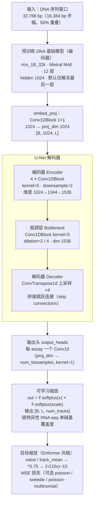
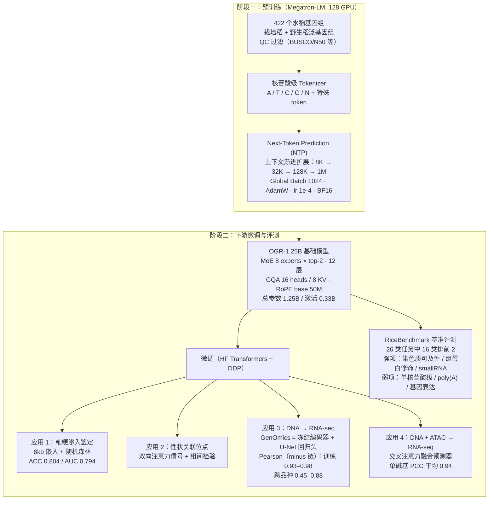

# OneGenome-Rice (OGR) 模型深度研究报告

> 研究日期：2026-09-02
> 信息来源：GitHub 仓库（zhejianglab/OneGenome-Rice）、本地工作区源码（`gene_expression_prediction/OneGenome-Rice/`、`RiceModel4-SFT-multi-species/`）、Hugging Face 模型页（ZhejiangLab/OneGenomeRice）、本地预训练模型配置（rice_1B 系列 / AgriGenome）
> bioRxiv 论文（10.64898/2026.04.21.719822v1）页面持续重定向无法直接抓取，相关内容基于 GitHub README 与源码交叉验证。

---

## 1. 模型简介与背景

**OneGenome-Rice (OGR)** 是浙江实验室（Zhejiang Lab）发布的**水稻基因组基础模型**，定位为"下一代 AI 驱动精准育种与功能基因组学的基础 AI 设施"。

**核心特征：**
- **生成式基因组基础模型**：可处理最长 **1M bp** 的 DNA 序列
- **1.25B 总参数**的 Mixture-of-Experts (MoE) 架构，推理时仅激活 **0.33B** 参数（高效能）
- 在 **422 个水稻基因组**（栽培稻 + 野生稻泛基因组）上预训练，覆盖现代高产品种与野生祖先群体

**解决的问题：**
1. 长上下文基因组序列建模（8kb → 1Mb）
2. 群体结构/进化模式识别（品种分类、籼粳血缘判定）
3. 基因调控信号解析（染色质可及性、组蛋白修饰、增强子）
4. 下游基因表达预测（DNA → RNA-seq 单碱基分辨率）
5. 变异效应预测、等位基因特异性表达建模（通过微调应用）

---

## 2. 预训练模型（基础模型）详细信息

### 2.1 训练数据

| 项目 | 内容 |
|---|---|
| 数据集名称 | QC 过滤的 **422 水稻基因组泛基因组**（补充表 S1） |
| 物种覆盖 | *Oryza sativa*（栽培稻，含 indica/japonica 等亚群）+ *Oryza rufipogon*（野生稻）等 |
| 数据来源 | 公开发表的组装基因组：NCBI GenBank、NGDC Genome Warehouse、Zenodo、PRJ 项目等 |
| 基因组规模 | 每个 ~360–490 Mb（如 ZS97 387 Mb、MH63 359–387 Mb、N22 388 Mb 等） |
| QC 指标 | BUSCO 93–99.9%、N50 25–37 Mb、端粒数、N 比例等 |
| 代表性品系 | ZS97（珍汕97）、MH63（明恢63）、IR8、N22、Azucena、Basmati334、DomSufid、Kato T2T 等 |

### 2.2 模型架构（Transformer decoder + MoE）

| 规格 | OGR-1.25B |
|---|---|
| **模型规模** | |
| 总参数量 | 1.25B |
| 激活参数量 | 0.33B |
| **架构** | |
| 架构类型 | MoE Transformer decoder |
| 专家数 | 8 个专家（top-2 路由） |
| 层数 | 12 |
| Attention 隐藏维度 | 1024 |
| 注意力头数 | 16（GQA，8 个 KV 组） |
| MoE 隐藏维度（每专家） | 4096（SwiGLU 激活） |
| 词汇表大小 | 128（padded；实际 DNA 词表 18） |
| 上下文长度 | 最高 1Mb |

**关键技术点：**
- **RoPE**：base 50,000,000（50M），支持超长上下文
- **GQA**：16 heads / 8 KV groups，降低 KV 缓存内存
- **Flash Attention** 内核
- **RMSNorm** 归一化、**SwiGLU** 专家 FFN
- 目标函数：**Next Token Prediction (NTP)**，核苷酸级 tokenizer（A/T/C/G/N + 特殊 token）

**本地确认的 HF 配置**（rice_1B_stage2_8k_hf/config.json，与 OGR 同源）：
```json
{
  "architectures": ["MixtralForCausalLM"],
  "hidden_size": 1024, "intermediate_size": 4096,
  "num_attention_heads": 16, "num_key_value_heads": 8,
  "num_hidden_layers": 12, "num_local_experts": 8,
  "num_experts_per_tok": 2, "vocab_size": 128,
  "max_position_embeddings": 1048576,
  "rope_theta": 50000000, "rms_norm_eps": 1e-5,
  "model_type": "mixtral", "tie_word_embeddings": false
}
```
实际 tokenizer 词表仅 18 个 token：`[PAD][UNK][CLS][SEP][MASK]` + **C/G/T/A/N** + `<CLS><SEP><EOD><MASK><PAD><s></s><UNK>`。

### 2.3 预训练方法

| 项目 | 内容 |
|---|---|
| 框架 | **Megatron-LM**，128 块 GPU |
| 并行策略 | 5D 并行（TP 张量 + PP 流水线 + CP 上下文 + DP 数据 + EP 专家并行） |
| 批量大小 | Global 1024，Micro 1 |
| 优化器 | AdamW（分布式分片） |
| 学习率 | peak 1e-4，cosine 衰减，5–10% warmup |
| 精度 | BF16 计算，softmax/梯度/路由用 FP32 |
| 上下文扩展 | **渐进式：8K → 32K → 128K → 1M tokens**（多阶段训练） |
| MoE 均衡 | 辅助损失 1×10⁻³ + router Z-loss 1×10⁻³ |
| 优化 | Grouped GEMM、AllToAll 调度、参数聚合与梯度归约重叠 |
| 数据加载 | 循环数据加载器，8 个 worker 进程 |

> 模型别名：本地基准目录中可见大量 **AgriGenome_1.2b / rice_1B_stage2_8k / rice_1B_32k / rice_1B_128k / rice_1B_1M** 等系列 checkpoint，均为 OGR 预训练流程的中间产物（iter 3000–51703 等），证明训练确实按 8k→32k→128k→1M 多阶段推进。

---

## 3. 基因表达预测应用（核心：applications/3）

### 3.1 任务定义

**单碱基分辨率 RNA-seq 预测**：给定基因组 DNA 序列窗口，预测链特异性转录输出（strand-specific RNA-seq 信号），联合建模序列上下文与调控信号。

**技术栈**：PyTorch + DDP/NCCL、Hugging Face Transformers（Trainer 训练循环）、pyBigWig、pyfaidx、PyYAML。

### 3.2 数据预处理

| 步骤 | 内容 |
|---|---|
| Signal Normalization | `renorm_bigwig.py` 将原始 BigWig 重归一化到共同尺度（按 ENCODE 规则：总信号 = 1,000,000 × 读长，缩放因子 = common_read_length / 原始读长） |
| Window Tiling | 全基因组按 **32,768 bp 窗口、16,384 bp 步幅（50% 重叠）** 切分（`sequence_split_and_meta_extract2.py`） |
| Metadata | 生成 `index_stat.json`（非零均值与 track 统计）+ `bigWig_labels_meta.csv`（链特异性 track 映射） |
| 染色体划分 | 按 accession/染色体自动划分训练/验证/测试集 |

**数据格式约定**：BigWig 命名为 `tissue_species_1.bw`（如 `CSQ_P1_1.bw`、`YG_P7_1.bw`）；组织类型在脚本中为 `CSQ`（抽穗期？）与 `YG`（幼穗？两个组织）；物种代号 P1/P4/P6（训练）、P7（验证）、P11（测试）。

**实际训练数据划分（data_prepare.sh）**：
- 训练：P1、P4、P6 三个品种 × CSQ、YG 两个组织
- 验证：P7
- 测试：P11
- 每条轨道单独生成 plus/minus 链 BigWig（`assay_titles="total RNA-seq"`，双链 track 输出）

### 3.3 模型架构（GenOmics）

```
DNA 序列 (32,768 bp)
    │
    ▼
预训练 DNA 基础模型 (rice_1B_32k, Mixtral MoE, 12 层)
   （默认只解冻最后一层 transformer block，其余冻结）
    │ last_hidden_state [B, L, 1024]
    ▼
├─ embedd_proj: Conv1DBlock(1024 → 1024, kernel=1)
    ▼
├─ func_genome_UNet（U-Net 风格编码器-解码器）
   ├─ Encoder: num_downsamples=4 × Conv1DBlock(kernel=5, downsample=2)
   │         （中间维度 proj_dim + dim_step×i）
   ├─ Bottleneck: Conv1DBlock(×2, dilation=2/4, kernel=5)
   └─ Decoder: 上采样 + 跳跃连接（skip connections）
    ▼ [B, proj_dim, L]
├─ output_heads: 每 assay 一个 Conv1d(proj_dim → biosamples, kernel=1)
    ▼
F.softplus(out) × F.softplus(scale[i])  ← 可学习缩放因子
    ▼
输出 [B, L, num_tracks]（链特异性 RNA-seq 覆盖度）
```




**关键维度**（train.py 默认参数）：
- `proj_dim`: 1024（UNet 输入特征维度）
- `num_downsamples`: 4（下采样块数）
- `bottleneck_dim`: 1536（瓶颈维度，须 > proj_dim）
- `max_sequence_length`: 32,768
- 基础模型每层输出 hidden 1024

**数据缩放（Enformer 风格）**：`targets / track_mean`，然后 `^0.75` 压缩，大于 10 的部分用 `2*sqrt(10x)-10` 线性化；预测反向还原。

### 3.4 训练方法

| 项目 | README 声明 | 实际脚本（run_train.sh / RiceModel4 运行日志） |
|---|---|---|
| 损失函数 | 可选 **mse / poisson / tweedie / poisson-multinomial**（默认 mse） | `--loss_func mse` |
| 优化器 | **Adafactor** | `optim="adafactor"` |
| 学习率 | cosine 调度，10% linear warmup | `--lr 0.00005`（5e-5） |
| 权重衰减 | 0.01 | `weight_decay=0.01` |
| 梯度裁剪 | max_norm=1.0 | `max_grad_norm=1.0` |
| Epochs | — | `--num_train_epochs 20` |
| Batch | — | batch=1/卡 × 梯度累积 10 × 8 卡 = 有效 80 |
| 精度 | bfloat16 + FlashAttention-2 | `bf16=True, fp16=False` |
| 冻结策略 | 默认仅解冻最后一层；也支持全参数微调 | 日志显示全套参数 1,390,585,604（全解冻版本） |
| 分布式 | DDP（torchrun，8 GPU） | nnodes=1, nproc_per_node=8 |
| 日志 | Weights & Biases + JSONL | wandb project "RNA-seq"（zhongliyuan-bgi-group） |

**关键训练日志数据（RiceModel4-SFT，同框架实现）**：
- Total train batch size = 200（含并行/分布式/累积）
- 训练集：12 条染色体全覆盖，每染色体 ~2.3 万个 32kb 窗口
- 训练 20 epochs，总耗时 ~82 小时（8 GPU），step 时间 ~12.6s（32k 长序列）
- 最终训练 loss ~0.05，每链 head 独立 loss 追踪（`loss_total_RNA-seq_+` / `loss_total_RNA-seq_-`）

### 3.5 推理流程

`predict.py` + `run_predict.sh`：
- 加载微调后的 `.safetensors` checkpoint
- 按测试染色体/accession 批量滑窗推理，输出碱基分辨率预测 track
- 支持 `--max_predict_samples`、DDP 分布式推理（2 GPU 示例）
- 评估时对每样本去头去尾 100bp（`[100:-100]`），指标见下

### 3.6 评测指标

`metrics.py` 提供完整零膨胀回归指标体系：
- **整体**：MSE、MAE、R²、**Pearson**、log1p-Pearson、Spearman
- **零值识别**：AUROC(zero)、AUPRC(zero)、AUPRC(nonzero)
- **非零区域**：nonzero-Pearson、nonzero-log1p-Pearson、nonzero-Spearman
- **样本级平均**：sample-mean MSE / MAE

### 3.7 基因表达预测结果（RiceModel4-SFT 实测）

**训练集（traindata，模型见过的品种）**——按染色体 × 链的 Pearson 中位数：

| 类型 | minus 链（负链基因） | plus 链（正链基因） |
|---|---|---|
| 训练集（traindata） | **0.80–0.98**（多数 0.93–0.98） | **0.38–0.66** |
| 跨品种泛化（full） | **0.45–0.88**（多数 0.68–0.88） | **0.61–0.67** |

**log1p 变换后 Pearson（panicle_metrics.csv，单碱基级）**：
- minus 链：traindata 0.979–0.992；跨品种 0.910–0.991
- plus 链：traindata 0.530–0.651；跨品种 0.548–0.658

**要点解读**：
- 负链（minus）预测显著优于正链（plus），推测与水稻基因正负链分布不对称、plus 链信号稀疏/动态范围大有关
- **跨品种泛化（品种级别 held-out）时 Pearson 明显下降**（如 Chr04 minus 0.977→0.873，Chr10 0.864→0.613），说明模型存在一定品种特异过拟合，跨品种迁移是主要挑战
- 绝对尺度恢复能力弱于相对丰度相关性（R² 波动大于 Pearson），与动态范围 >10⁵ 的数据特性一致

---

## 4. 多模态基因表达预测（applications/4：DNA + ATAC → RNA）

### 4.1 任务
给定基因组 DNA 序列窗口 + 对齐的染色质可及性信号（ATAC-seq），预测链特异性 RNA-seq 信号（正负链），单碱基分辨率。旨在**分离"序列编码的潜力"与"环境依赖的激活"**。

### 4.2 数据
- 来自 **Zhu et al. (2024) Nature Communications 15:6562**（水稻 regulome 图谱，含配对参考基因组 + ATAC-seq + RNA-seq 的生物样本）
- 窗口 32kb（默认 target_len 32000，overlap 16000）
- RNA 预处理：HISAT2 比对 → 链特异 BigWig（CPM 归一化）
- ATAC 预处理：Trimmomatic → Bowtie2 → bamCoverage（RPGC 归一化，mapQ≥30,bin1）

### 4.3 架构（MultiModalPredictorFusion）

```
DNA 序列 (32kb)                     ATAC-seq (32kb)
    │                                  │
    ▼                                  ▼
AgriGenome 编码器                ATAC Transformer encoder
(L/4 下采样)                      → [B,1024,L]
    │                                  │
    └──────── L/4 双向交叉注意力 ────────┘
         CrossAttentionSDPA ×2 (8 heads, d=1024)
              │
        4-way gated MLP (token-wise)
  融合: [ATAC自特征, DNA自特征, 两个交叉注意力特征]
              │
    post-fusion bottleneck（膨胀卷积 1/2/4）
              │
    U-Net 上采样解码器（conv-transpose ×2）
              │
    全分辨率 dual-skip gated injection (DNA+ATAC)
              │
    最终 head：2 通道输出（+ / - 链）
```

**编码策略**：AgriGenome 基础模型默认**完全冻结**（`unfreeze_base_last_layer: false` 时可解冻最后一层）；ATAC 编码器与融合网络可训练。

### 4.4 训练
- **MSE** 回归目标 + 可选融合门/跳连门**熵正则**（MSE 的分数比例，鼓励门控均衡使用）
- Adafactor 优化器
- **判别式学习率**：backbone 3e-5 / head 1.5e-4
- 80 epochs，linear 调度，warmup 5%，wd 0.01，梯度裁剪 1.0
- 窗口 32kb，batch 5/卡 × 累积 20

### 4.5 结果
- **测试集单碱基 PCC 平均 0.94（范围 0.936–0.954）**——有效捕捉 RNA 表达的相对丰度与空间分布
- **R² 波动大：0.50–0.97**——绝对表达尺度恢复挑战大（动态范围 >10⁵）
- 结论：模型能捕捉染色质架构与 DNA 序列调控 RNA 表达的关键交互模式

---

## 5. 预训练-微调流程总结

```
Stage 1: 预训练（Megatron-LM, 128 GPU）
   422 水稻基因组 → 8K → 32K → 128K → 1M 渐进上下文
   → OGR-1.25B (MoE 8×top2, GQA, RoPE-50M, NTP)
        │
        │ 转换为 HF 格式（MixtralForCausalLM，vocab 128 padded）
        ▼
Stage 2: 微调（HF Transformers Trainer + DDP）
   ├─ 应用3（单模态 DNA→RNA-seq）: GenOmics = 冻结DNA编码器(解冻末层) + UNet 回归头
   │    32kb 窗口, MSE, Adafactor, lr 5e-5, 20 epochs, BF16+FlashAttn2
   ├─ 应用4（多模态 DNA+ATAC→RNA-seq）: 冻结编码器 + ATAC transformer + 交叉注意力融合 + UNet
   │    32kb 窗口, MSE+熵正则, 判别式LR(3e-5/1.5e-4), 80 epochs
   └─ 应用1（品种分类）: 不微调，8kb 嵌入 + 随机森林下游分类器
```



---

## 6. 基准评测（RiceBenchmark，26 类任务）

### 6.1 整体结论
- OGR 在 **26 类基准任务中的 16 个排第 1 或第 2**，综合表现强劲
- **优势领域**：染色质可及性、组蛋白修饰、small RNA 预测、增强子强度、sweep 区识别、品种分类——说明其有效捕获基因组调控信号与跨尺度功能模式

### 6.2 分任务表现
| 任务类型 | 表现 |
|---|---|
| 短序列任务 | 综合表现好；染色质可及性/表观标记/smallRNA 强，**剪接位点识别、变异检测较弱** |
| 长序列任务 | 各任务稳定，变异检测在长上下文上有优势，但不全面领先 |
| 单核苷酸任务 | **明显差距**——核苷酸级高分辨率建模能力有限 |
| Sweep 区识别 | 长上下文（8–100kb）下优势明显 |
| 品种分类 | 随着序列长度增加**持续优于其他模型**（群体结构与进化模式识别强） |
| AgroNT 基准 | 染色质可及性强；**poly(A) 位点与基因表达预测弱**（细粒度调控建模短板） |

### 6.3 本地实测（AgriGenome/rice_1B 系列 MLP 下游）
- 品种分类回归（32k 窗口）：层 12 嵌入 → Pearson 0.519 / Spearman 0.506 / R² 0.261
- Enhancer 预测：层 3-4 嵌入 ROC-AUC ~0.96、准确率 ~0.89、MCC ~0.79
- 组蛋白修饰（small 版）：ROC-AUC ~0.67（MLP 线性评估下）
- CDS 多标签：ROC-AUC ~0.82（层 3）

> 注意：以上为线性/MLP 探针结果，与 OGR README 报告的微调后 16/26 领先地位不同口径，但方向上一致（增强子/表观强、高分辨率弱）。

---

## 7. 应用案例详解

### Case 1：籼稻-粳稻血缘渗入鉴定
- **方法**：无需比对、无需 SNP，直接用 OGR 从原始基因组序列提取 **8,000 bp 窗口嵌入**，训练**随机森林**分类器预测亚群归属概率（P_indica / P_japonica）
- **数据**：20 个训练样本（10 indica + 10 温带 japonica）+ 2 个测试样本，来自 RiceVarMap 亚群标签 + 3KRGP
- **结果**：测试集 **ACC 0.804、AUC 0.794**
- 应用案例：YF47（盐丰47）粳稻中的籼稻渗入鉴定，渗入以延伸块段而非孤立位点呈现

### Case 2：性状关联位点识别
- 从 VCF 变异重建样本特异序列 → 提取**正向与反向互补注意力** → 位置级组间比较（Mann-Whitney U + BH 校正）→ 基因级汇总（Peak Density、Shannon Entropy）
- 40kb 候选区以 8kb 窗口、4kb 步幅切分；使用 OGR **8kb HF 模型**

### Case 3：DNA 序列基因表达预测（见第 3 节）
- 下游应用：**cis 调控变异效应预测、等位基因特异性表达建模、转录组指导的育种设计**

### Case 4：多模态（DNA + ATAC）基因表达预测（见第 4 节）

---

## 8. 部署与使用

```bash
# Docker
docker pull zjlabogr/onegenomerice:mega
docker run -it --gpus all --shm-size 32g zjlabogr/onegenomerice:mega /bin/bash

# 模型下载
# HF:   https://huggingface.co/ZhejiangLab/OneGenomeRice (OGR-1.25B)
# MS:   https://modelscope.cn/models/zhejianglab/OneGenomeRice
# 基准: HuggingFace datasets ZhejiangLab/RiceBenchmark / ModelScope zhejianglab/RiceBenchmark
```

**许可证**：Apache License 2.0

**训练基础设施**：021 大型科学模型、Zero2X 开放平台、南湖计算框架（Nanhu Computing Framework）

**联系**：opensource@zhejianglab.org / OneGenomeRice@zhejianglab.org / bgi-plant@genomics.cn

---

## 9. 关键数字速查表

| 项目 | 数值 |
|---|---|
| 总参数 | 1.25B（激活 0.33B） |
| 预训练基因组数 | 422 个水稻基因组 |
| 上下文长度 | 8K/32K/128K/1M（渐进） |
| MoE | 8 experts, top-2 |
| 层数 / hidden / heads | 12 / 1024 / 16 (GQA 8 KV) |
| 预训练 GPU | 128（Megatron-LM, 5D 并行） |
| 预训练 LR | 1e-4（cosine, 5-10% warmup） |
| 表达预测窗口 | 32,768 bp（16,384 overlap） |
| 表达预测损失 | MSE（可选 poisson/tweedie/poisson-multinomial） |
| 微调 LR / epochs | 5e-5 / 20（或判别式 3e-5/1.5e-4 / 80） |
| 微调 optimize | Adafactor, cosine, wd 0.01, clip 1.0, BF16 |
| 训练集表达 Pearson（minus 链） | 0.93–0.98 |
| 跨品种表达 Pearson（minus 链） | 0.45–0.88 |
| log1p 跨品种 Pearson（minus） | 0.91–0.99 |
| 多模态 PCC（DNA+ATAC） | 平均 0.94（0.936–0.954） |
| 多模态 R² | 0.50–0.97 |
| 基准任务领先数 | 26 类中 16 类排前 2 |
| 品种分类 ACC/AUC | 0.804 / 0.794 |

---

## 10. 源文件路径索引

**OGR 官方仓库（本地镜像）**：
- `OneGenome-Rice/README.md` — 主 README（模型信息、架构、训练、基准、应用）
- `OneGenome-Rice/figure/422 Curated Assembled Genome Collection.tsv` — 422 基因组清单
- `OneGenome-Rice/applications/1.identification_of_indica-japonica_introgression/` — 渗入鉴定
- `OneGenome-Rice/applications/2.identification_of_trait-associated_loci/` — 性状位点
- `OneGenome-Rice/applications/3.gene_expression_prediction_of_DNA_sequence/` — 单模态表达预测
  - `src/model.py`（GenOmics + U-Net 完整实现）、`src/dataset.py`、`src/metrics.py`、`src/viewer.py`
  - `train.py` / `predict.py` / `run_train.sh` / `run_predict.sh` / `data_prepare.sh`
  - `scripts/data_preprocess/`（renorm_bigwig.py、sequence_split_and_meta_extract2.py 等）
- `OneGenome-Rice/applications/4.gene_expression_prediction_based_on_multi_modal_data/` — 多模态
  - `model/predictor_fusion.py`（融合预测器）、`model/encoder_transformer.py`、`AGENTS.md`、`senario.md`
- `OneGenome-Rice/evaluation/benchmark_code/` — RiceBenchmark 基准代码

**相关工作区工程**：
- `RiceModel4-SFT-multi-species/` — OGR 表达预测框架的实际训练实现（同源，含实测结果 CSV 与日志）
- 预训练权重本地副本：`/mnt/rice/default/Workspace/xuxiaolong/rice_1B_stage2_8k_hf/`（含 config.json，Mixtral 架构）
- 更多 checkpoint：`/mnt/rice/default/Workspace/liqian/benchmarkout/results_path/`（AgriGenome_*、rice_1B_32k/128k/1M 等）

**线上资源**：
- GitHub: https://github.com/zhejianglab/OneGenome-Rice
- bioRxiv: https://www.biorxiv.org/content/10.64898/2026.04.21.719822v1
- HF: https://huggingface.co/ZhejiangLab/OneGenomeRice
- ModelScope: https://modelscope.cn/models/zhejianglab/OneGenomeRice