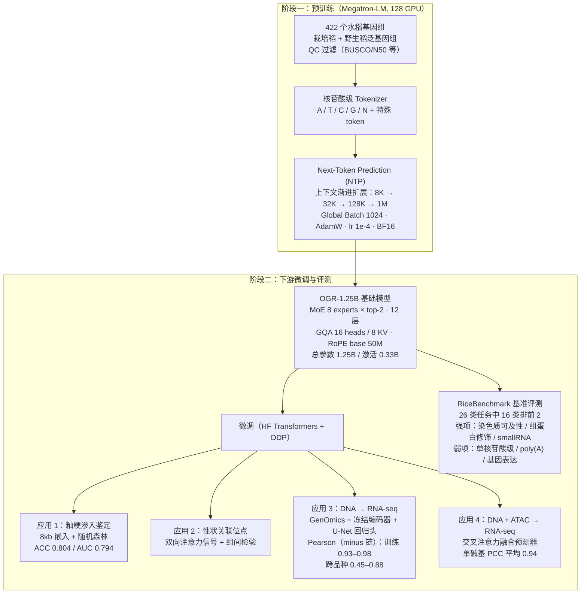
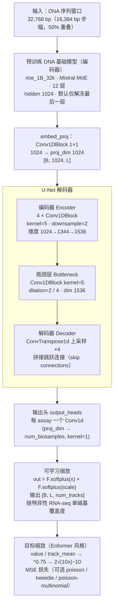

# OneGenome-Rice (OGR)：水稻基因组基础模型

> 本文档基于 [OneGenome-Rice 官方 GitHub 仓库](https://github.com/zhejianglab/OneGenome-Rice)、[bioRxiv 论文](https://www.biorxiv.org/content/10.64898/2026.04.21.719822v1)（10.64898/2026.04.21.719822v1）以及本工作区内的源码实现整理。

- **GitHub**：https://github.com/zhejianglab/OneGenome-Rice
- **bioRxiv**：https://www.biorxiv.org/content/10.64898/2026.04.21.719822v1
- **模型权重（HF）**：https://huggingface.co/ZhejiangLab/OneGenomeRice
- **模型权重（ModelScope）**：https://modelscope.cn/models/zhejianglab/OneGenomeRice
- **基准数据集（HF）**：https://huggingface.co/datasets/ZhejiangLab/RiceBenchmark
- **许可证**：Apache License 2.0

---

## 目录

1. [模型简介](#1-模型简介)
2. [整体工作流](#2-整体工作流)
3. [预训练数据](#3-预训练数据)
4. [模型架构](#4-模型架构)
   - 4.1 [基础模型架构（MoE Transformer）](#41-基础模型架构moe-transformer)
   - 4.2 [关键技术点](#42-关键技术点)
5. [预训练方法](#5-预训练方法)
6. [性能评测（RiceBenchmark）](#6-性能评测ricebenchmark)
7. [下游应用](#7-下游应用)
8. [基因表达预测：应用 3 详解](#8-基因表达预测应用-3-详解)
   - 8.1 [任务定义与数据](#81-任务定义与数据)
   - 8.2 [GenOmics 架构](#82-genomics-架构)
   - 8.3 [训练方法](#83-训练方法)
   - 8.4 [评测指标与结果](#84-评测指标与结果)
9. [多模态表达预测：应用 4 详解](#9-多模态表达预测应用-4-详解)
10. [快速开始](#10-快速开始)
11. [已知局限](#11-已知局限)
12. [引用与致谢](#12-引用与致谢)

---

## 1. 模型简介

**OneGenome-Rice (OGR)** 是浙江实验室发布的**水稻基因组基础模型**，定位为下一代 AI 驱动精准育种与功能基因组学的基础 AI 设施。

OGR 是一个**生成式基因组基础模型**，具备以下核心特征：

- **超长上下文建模**：可处理最长 **1M bp（1 兆碱基）** 的 DNA 序列，覆盖染色体级调控结构域；
- **MoE 高效架构**：总参数 **1.25B**，采用 Mixture-of-Experts 架构，推理时仅激活 **0.33B** 参数，兼具高表示容量与推理高效性；
- **泛基因组预训练**：在 QC 过滤的 **422 个水稻基因组**（栽培稻 + 野生稻泛基因组，覆盖现代高产品种与野生祖先群体）上以上下文预测目标预训练；
- **多尺度下游能力**：品种分类、籼粳血缘渗入鉴定、染色质可及性/组蛋白修饰/smallRNA/增强子预测、Sweep 区识别、性状关联位点识别，以及单碱基分辨率的 DNA → RNA-seq 基因表达预测。

OGR 面向的核心科学问题：

1. 长上下文基因组序列建模（8kb → 1Mb）；
2. 群体结构与进化模式识别（品种分类、籼粳血缘判定）；
3. 基因调控信号解析（染色质可及性、组蛋白修饰、增强子）；
4. 基因表达预测（DNA → RNA-seq 单碱基分辨率，支持 cis 调控变异效应预测、等位基因特异性表达建模、转录组指导的育种设计）；
5. 多模态调控建模（DNA + ATAC-seq → RNA 表达）。

---

## 2. 整体工作流

OGR 采用"**预训练基础模型 + 下游微调应用**"的经典范式：先在大规模多物种泛基因组上预训练解码器模型，再针对具体任务微调或直接抽取嵌入构建下游预测器。整体流程如下图所示：



<details>
<summary>📄 架构图源文件</summary>

- `diagrams/ogr_overview.mmd` — OGR 整体工作流
- `diagrams/genomics_expr.mmd` — 应用 3（DNA → RNA-seq）GenOmics 架构

</details>

---

## 3. 预训练数据

| 项目 | 内容 |
|---|---|
| 数据集 | **QC 过滤的 422 个水稻基因组泛基因组**（详见官方 `figure/422 Curated Assembled Genome Collection.tsv`） |
| 物种覆盖 | *Oryza sativa*（栽培稻，含 indica / japonica 等亚群）+ *Oryza rufipogon*（野生稻）等，覆盖现代高产品种与野生祖先群体 |
| 数据来源 | 公开发表文献中的开放组装基因组（NCBI GenBank、NGDC Genome Warehouse、Zenodo 等公共数据库） |
| 基因组规模 | 每个约 360–490 Mb（如 ZS97 387 Mb、MH63 359–387 Mb、N22 388 Mb 等） |
| QC 指标 | BUSCO 93–99.9%、N50 25–37 Mb、端粒数、N 比例等 |
| 代表性品系 | ZS97（珍汕97）、MH63（明恢63）、IR8、N22、Azucena、Basmati334、DomSufid、Kato T2T 等 |
| 编码方式 | 原始 DNA + 核苷酸级 tokenizer（A / T / C / G / N + 特殊 token） |

数据来源强调公开、可复现：所有组装均来自已发表文献与公共数据库，支持后续研究者复现训练语料。

---

## 4. 模型架构

### 4.1 基础模型架构（MoE Transformer）

OGR 采用 **Transformer decoder + Mixture-of-Experts（MoE）** 架构，主要技术亮点：

- **超长上下文**：**RoPE**（base 50,000,000）支撑最高 **1M tokens**；多阶段训练逐步扩展有效上下文窗口；
- **高效注意力**：**GQA**（16 heads / 8 KV groups）+ **Flash Attention** 内核，显著降低 KV 缓存内存；
- **MoE 路由**：**8 个专家、每 token top-2**、SwiGLU 专家 FFN、RMSNorm 归一化；训练目标为 **next-token prediction (NTP)**。

关键规格汇总：

| 模型规格 | OneGenome-Rice (OGR) |
|---|---|
| **模型规模** | |
| 总参数量 | **1.25B** |
| 激活参数量 | **0.33B** |
| **架构** | |
| 架构类型 | MoE（Transformer decoder） |
| 专家数 | 8 |
| 每 token 选择专家数 | 2（top-2） |
| 层数 | 12 |
| Attention 隐藏维度 | 1024 |
| 注意力头数 | 16（GQA，8 个 KV 组） |
| MoE 隐藏维度（每专家） | 4096（SwiGLU） |
| 词汇表大小 | 128（padded；实际 DNA 词表 18：`[PAD][UNK][CLS][SEP][MASK]` + A/T/C/G/N + 特殊 token） |
| 上下文长度 | 最高 **1Mb** |

本地确认的 Hugging Face 配置（`rice_1B_stage2_8k_hf/config.json`，与 OGR 同源，确认 `MixtralForCausalLM` 架构）：

```json
{
  "architectures": ["MixtralForCausalLM"],
  "hidden_size": 1024,
  "intermediate_size": 4096,
  "num_attention_heads": 16,
  "num_key_value_heads": 8,
  "num_hidden_layers": 12,
  "num_local_experts": 8,
  "num_experts_per_tok": 2,
  "vocab_size": 128,
  "max_position_embeddings": 1048576,
  "rope_theta": 50000000,
  "rms_norm_eps": 1e-5,
  "model_type": "mixtral",
  "tie_word_embeddings": false
}
```

### 4.2 关键技术点

| 组件 | 说明 |
|---|---|
| 位置编码 | **RoPE**，base 50M，支撑 1M 超长上下文 |
| 注意力 | **GQA**（16 heads / 8 KV groups）+ **Flash Attention** |
| 归一化 | **RMSNorm** |
| 专家 FFN | **SwiGLU**，8 experts / top-2，MoE 隐藏维度 4096 |
| 预训练目标 | 自监督 **Next-Token Prediction (NTP)**，核苷酸级建模 |
| 上下文扩展 | 渐进式 **8K → 32K → 128K → 1M** tokens 多阶段训练 |

---

## 5. 预训练方法

OGR 预训练基于 **[Megatron-LM](https://github.com/NVIDIA/Megatron-LM)**，采用 **5D 并行**（TP / PP / CP / DP / EP）：

| 项目 | 内容 |
|---|---|
| 框架 | Megatron-LM，**128 块 GPU** |
| 并行策略 | 5D：TP（张量）+ PP（流水线）+ CP（上下文）+ DP（数据）+ EP（专家） |
| 批量大小 | Global **1024**，Micro **1** |
| 优化器 | AdamW（分布式分片） |
| 学习率 | peak **1e-4**，cosine 衰减，5–10% warmup |
| 精度 | **BF16** 计算，softmax / 梯度 / 路由使用 **FP32** |
| 上下文扩展 | **8K → 32K → 128K → 1M** tokens（渐进式多阶段） |
| MoE 均衡 | 辅助损失 **1×10⁻³** + router **Z-loss 1×10⁻³** |
| 通信/计算优化 | Grouped GEMM、AllToAll 调度、参数聚合与梯度归约重叠 |
| 数据加载 | 循环数据加载器，8 个 worker 进程 |

> 本地训练目录可见 `rice_1B_stage2_8k` / `rice_1B_32k` / `rice_1B_128k` / `rice_1B_1M` 等系列 checkpoint，印证了 8k → 32k → 128k → 1M 的多阶段预训练推进过程。

---

## 6. 性能评测（RiceBenchmark）

OGR 发布了专门的水稻基准 **RiceBenchmark**（26 类任务），覆盖短序列任务、长序列任务、单核苷酸任务、Sweep 区识别、品种分类与 AgroNT 基准等全谱系基因组预测任务。

**整体结论**：在 26 类基准任务中，OGR 有 **16 类排名第 1 或第 2**，综合表现强劲，在多种基因组预测任务上展现出良好的泛化能力。

| 任务类型 | 表现 |
|---|---|
| 短序列任务 | 综合表现好；**染色质可及性、表观标记（组蛋白修饰）、small RNA 预测强**；剪接位点识别、变异检测较弱 |
| 长序列任务 | 各任务稳定；短上下文下变异检测较弱，更长上下文（8–100kb）下显现优势 |
| 单核苷酸任务 | **存在明显差距**——核苷酸级高分辨率建模能力有限 |
| Sweep 区识别 | **长上下文（8kb–100kb）下优势明显**，能捕捉大尺度基因组信号 |
| 品种分类 | 随序列长度增加**持续优于其他模型**，群体结构与进化模式识别能力强 |
| AgroNT 基准 | **染色质可及性预测强**；**poly(A) 位点与基因表达预测较弱**（细粒度调控建模短板） |

**优势领域汇总**：染色质可及性、组蛋白修饰、small RNA 预测、增强子强度、Sweep 区识别、品种分类——说明 OGR 能有效捕获基因组调控信号与跨尺度的功能模式。

---

## 7. 下游应用

为展示 OGR 的实用价值、可扩展性与潜力，官方提供了 4 个代表性的应用案例：

| 应用 | 方法 | 关键结果 |
|---|---|---|
| **应用 1：籼稻-粳稻渗入鉴定** | 无需比对、无需 SNP，直接以 OGR 从原始序列提取 **8,000 bp 窗口嵌入** + 随机森林分类器（20 训练样本：10 indica + 10 japonica；2 测试样本） | 测试集 **ACC 0.804 / AUC 0.794**；如 YF47 粳稻中的籼稻渗入以延伸块段而非孤立位点呈现 |
| **应用 2：性状关联位点识别** | 从 VCF 变异重建样本特异序列 → 提取正向与反向互补注意力 → 位置级组间比较（Mann-Whitney U + BH 校正）→ 基因级汇总（Peak Density、Shannon Entropy）；40kb 候选区以 8kb 窗口、4kb 步幅切分 | 可复现的候选基因定位工作流 |
| **应用 3：DNA 序列基因表达预测** | **GenOmics** = 预训练 DNA 语言模型编码器 + U-Net 回归头（详见 [第 8 节](#8-基因表达预测应用-3-详解)） | minus 链 Pearson：训练 0.93–0.98 / 跨品种 0.45–0.88（log1p 后 0.91–0.99） |
| **应用 4：多模态基因表达预测** | 预训练编码器 + ATAC Transformer + **L/4 双向交叉注意力融合** + U-Net（详见 [第 9 节](#9-多模态表达预测应用-4-详解)） | 测试集单碱基 **PCC 平均 0.94**（0.936–0.954），R² 0.50–0.97 |

### 案例 1 详解：籼稻-粳稻血缘渗入鉴定

- 与传统基于 SNP 统计或局部序列比对的方法不同，本方法直接从原始基因组序列出发；
- 基于 OGR 模型提取高维嵌入，构建下游预测模型，捕获**序列层面的深层遗传结构差异**；
- 实现籽粒亚群起源的精细推断，识别亚种间潜在的渗入区段。

### 案例 2 详解：性状关联位点识别

- 从变异位点（VCF）重建样本特异的基因组序列；
- 提取 OGR 的正向与反向互补**双向注意力信号**；
- 进行位置级组间比较（Mann-Whitney U 检验 + Benjamini-Hochberg 校正）；
- 在选定候选区域中汇总基因级差异信号（Peak Density、Shannon Entropy）。

---

## 8. 基因表达预测：应用 3 详解

> 仓库：`applications/3.gene_expression_prediction_of_DNA_sequence/`
> 工作区对应实际训练工程：`RiceModel4-SFT-multi-species/`（提供论文未公开的实测指标）

### 8.1 任务定义与数据

**任务**：给定基因组 DNA 序列窗口，预测**单碱基分辨率、链特异性（strand-specific）的 RNA-seq 信号**，联合建模序列上下文与调控信号。

**数据预处理管线**（`data_prepare.sh` / `scripts/data_preprocess/`）：

| 步骤 | 内容 |
|---|---|
| Signal Normalization | `renorm_bigwig.py`：将原始 BigWig 按 ENCODE 规则重归一化到共同尺度（总信号 = 1,000,000 × 读长，缩放因子 = common_read_length / 原始读长） |
| Window Tiling | `sequence_split_and_meta_extract2.py`：全基因组按 **32,768 bp 窗口、16,384 bp 步幅（50% 重叠）** 切分 |
| Metadata | 生成 `index_stat.json`（非零均值与 track 统计）+ `bigWig_labels_meta.csv`（链特异性 track 映射） |
| 染色体划分 | 按 accession / 染色体自动划分训练 / 验证 / 测试集 |

**实际训练数据划分**（本地 `data_prepare.sh` 实测）：

- 训练：**P1、P4、P6** 三个品种 × 两个组织（total RNA-seq，正负链双 track BigWig：`CSQ_P1_1.bw`、`YG_P7_1.bw` 等）
- 验证：**P7**；测试：**P11**
- 每条轨道单独生成 plus / minus 链 BigWig

### 8.2 GenOmics 架构

**GenOmics** 由三部分组成：**预训练 DNA 基础模型编码器** + **嵌入投影层** + **U-Net 风格回归头**。



**各模块细节**：

1. **编码器（DNA 基础模型）**
   - 预训练 DNA 语言模型（32k context，rice_1B_32k），`last_hidden_state` 形状 `[B, L, 1024]`；
   - 默认**只解冻最后一层 transformer block**，其余层冻结（也支持全参数微调）。

2. **嵌入投影（embedd_proj）**
   - `Conv1DBlock(base_hidden 1024, proj_dim 1024, kernel_size=1)`；
   - 将 hidden state 转置为 `[B, proj_dim, L]` 供 CNN 处理。

3. **U-Net 回归头（func_genome_UNet）**
   - 编码器：`num_downsamples=4` 个 `Conv1DBlock`（kernel=5，downsample=2），维度从 1024 逐级增至瓶颈 1536（`dim_step = (bottleneck - proj) / num_downsamples`）；
   - 瓶颈：2 个 `Conv1DBlock`（kernel=5，dilation=2 / 4，维度 1536）；
   - 解码器：`ConvTranspose1d` 上采样 + 跳跃连接（skip connections）拼接，逐步恢复全分辨率。

4. **输出头与激活**
   - 每个 assay 一个 `nn.Conv1d(proj_dim, num_biosamples, kernel_size=1)`；
   - 输出经 **softplus** 激活并乘以可学习缩放因子：`out = F.softplus(x) × F.softplus(scale)`，保证输出非负，适配基因组信号。

**关键维度**（`train.py` / `predict.py` 默认参数）：`proj_dim=1024`、`num_downsamples=4`、`bottleneck_dim=1536`、`max_sequence_length=32768`。

**数据缩放（Enformer 风格）**：训练目标先按 `value / track_mean` 归一化，再取 `^0.75` 压缩（>10 的部分用 $2\sqrt{10x}-10$ 线性化），预测时反向还原。

### 8.3 训练方法

| 项目 | 配置 |
|---|---|
| 损失函数 | **MSE**（默认），可选 poisson / tweedie / poisson-multinomial |
| 优化器 | **Adafactor**，cosine 学习率调度（10% linear warmup） |
| 学习率 | **5e-5** |
| 权重衰减 | 0.01 |
| 梯度裁剪 | max_norm = 1.0 |
| Epochs | **20**（多模态应用为 80） |
| Batch | batch=1/卡 × 梯度累积 10 × 8 卡（DDP） |
| 精度 | **BF16** + **FlashAttention-2** |
| 冻结策略 | 默认仅解冻最后一层（亦可全参数微调，全套参数约 1.39B） |
| 分布式 | DDP（`torchrun`，8 GPU） |
| 日志 | Weights & Biases + JSONL，per-head 独立 loss 追踪 |

**实测训练日志**（`RiceModel4-SFT-multi-species`，同框架实现）：Total train batch ≈ 200；12 条染色体全覆盖，每染色体约 2.3 万个 32kb 窗口；训练 20 epochs 约 82 小时（8 GPU），step 时间约 12.6s（32k 长序列）；最终训练 loss ≈ 0.05，正负链 head 独立追踪。

### 8.4 评测指标与结果

**评测指标**（`src/metrics.py`，零膨胀回归指标体系）：

- 整体：MSE、MAE、R²、**Pearson**、log1p-Pearson、Spearman；
- 零值识别：AUROC(zero)、AUPRC(zero)、AUPRC(nonzero)；
- 非零区域：nonzero-Pearson、nonzero-log1p-Pearson、nonzero-Spearman；
- 样本级：sample-mean MSE / MAE。

**基因表达预测结果**（RiceModel4-SFT 实测，按染色体 × 链的 Pearson 中位数）：

| 场景 | minus 链（负链基因） | plus 链（正链基因） |
|---|---|---|
| 训练集（traindata，同品种） | **0.80–0.98**（多数 0.93–0.98） | 0.38–0.66 |
| 跨品种泛化（held-out 品种） | **0.45–0.88**（多数 0.68–0.88） | 0.61–0.67 |

**log1p 变换后 Pearson（单碱基级，panicle_metrics.csv）**：

| 场景 | minus 链 | plus 链 |
|---|---|---|
| traindata | 0.979–0.992 | 0.530–0.651 |
| 跨品种 | 0.910–0.991 | 0.548–0.658 |

**要点解读**：

- **负链（minus）显著优于正链（plus）**：推测与水稻基因组正负链基因分布不对称、plus 链信号稀疏 / 动态范围大有关；
- **跨品种泛化是关键挑战**：品种级别 held-out 时 Pearson 明显下降（如 Chr04 minus 0.977 → 0.873，Chr10 0.864 → 0.613），说明存在一定品种特异过拟合；
- 绝对尺度恢复能力弱于相对丰度相关性（R² 波动大于 Pearson），与数据动态范围 >10⁵ 的特性一致。

---

## 9. 多模态表达预测：应用 4 详解

> 仓库：`applications/4.gene_expression_prediction_based_on_multi_modal_data/`

**任务**：给定基因组 DNA 序列窗口 + 对齐的染色质可及性信号（ATAC-seq），预测链特异性 RNA-seq 信号（单碱基分辨率）。通过显式建模 DNA–ATAC 交互，**分离"序列编码的潜力"与"环境依赖的激活"**。

**数据**：Zhu et al. (2024) *Nature Communications* 15:6562（水稻 regulome 图谱，含配对参考基因组 + ATAC-seq + RNA-seq 的生物样本）；32kb 窗口（默认 target_len 32000，overlap 16000）。

- RNA 预处理：HISAT2 比对 → 链特异 BigWig（CPM 归一化）；
- ATAC 预处理：Trimmomatic → Bowtie2 → bamCoverage（RPGC 归一化，mapQ≥30, bin1）。

**架构（MultiModalPredictorFusion）**：

```
DNA 序列 (32kb)                     ATAC-seq (32kb)
    │                                  │
    ▼                                  ▼
AgriGenome 编码器                ATAC Transformer encoder
(L/4 下采样)                      → [B, 1024, L]
    │                                  │
    └──────── L/4 双向交叉注意力 ────────┘
         CrossAttentionSDPA ×2 (8 heads, d=1024)
              │
        4-way gated MLP（token-wise）
   融合: [ATAC 自特征, DNA 自特征, 两个交叉注意力特征]
              │
    post-fusion bottleneck（膨胀卷积 1/2/4）
              │
    U-Net 上采样解码器（conv-transpose ×2）
              │
    全分辨率 dual-skip gated injection（DNA + ATAC）
              │
    最终 head：2 通道输出（+ / − 链）
```

**编码策略**：AgriGenome 基础模型默认完全冻结（可解冻最后一层）；ATAC 编码器与融合网络可训练。

**训练**：MSE 回归目标 + 可选融合门 / 跳连门熵正则（鼓励门控均衡使用）；Adafactor；**判别式学习率**（backbone 3e-5 / head 1.5e-4）；80 epochs，linear 调度，warmup 5%，wd 0.01，梯度裁剪 1.0；32kb 窗口，batch 5/卡 × 累积 20。

**结果**：

| 指标 | 数值 | 解读 |
|---|---|---|
| 测试集单碱基 **PCC** | 平均 **0.94**（0.936–0.954） | 有效捕捉 RNA 表达的相对丰度与空间分布 |
| **R²** | 0.50–0.97（波动大） | 绝对表达尺度恢复挑战大（动态范围 >10⁵） |

结论：模型能够捕捉染色质架构与 DNA 序列调控 RNA 表达的关键交互模式。

---

## 10. 快速开始

### Docker 部署

```bash
docker pull zjlabogr/onegenomerice:mega
docker run -it --gpus all --shm-size 32g zjlabogr/onegenomerice:mega /bin/bash
```

### 模型下载

| 模型 | 总参数 | Hugging Face | ModelScope |
|---|---|---|---|
| OGR-1.25B | 1.25B | [🤗 Hugging Face](https://huggingface.co/ZhejiangLab/OneGenomeRice) | [🤖 ModelScope](https://modelscope.cn/models/zhejianglab/OneGenomeRice) |

### 基准数据集下载

| 基准 | Hugging Face | ModelScope |
|---|---|---|
| RiceBenchmark | [🤗 Hugging Face](https://huggingface.co/datasets/ZhejiangLab/RiceBenchmark) | [🤖 ModelScope](https://modelscope.cn/datasets/zhejianglab/RiceBenchmark) |

### 技术栈（应用 3/4）

- **PyTorch** + **DDP/NCCL**（多 GPU 分布式）
- **Hugging Face Transformers**（Trainer 训练循环，集成冻结/解冻 DNA 语言模型）
- 基因组 I/O：`pyBigWig`、`pyfaidx`；配置：PyYAML
- 环境：CUDA 12.1+，PyTorch 2.0+（BF16 混合精度 + FlashAttention-2）

### 基因表达预测使用流程（应用 3）

```bash
# 1. 数据准备（BigWig 重命名 tissue_species_1.bw → 生成窗口索引与元数据）
./data_prepare.sh

# 2. 训练（DDP 8 卡，默认冻结编码器只解冻末层 + U-Net）
./run_train.sh

# 3. 推理（滑窗批量推理，输出碱基分辨率预测 track）
./run_predict.sh
```

关键训练参数：`--model_path`（预训练基础模型）、`--lr 0.00005`、`--batch_size_per_device 1`、`--gradient_accumulation_steps 10`、`--num_train_epochs 20`、`--loss_func mse`、`--max_sequence_length 32768`、`--use_flash_attn`。

---

## 11. 已知局限

- **单核苷酸级高分辨率建模能力有限**（RiceBenchmark 单核苷酸任务存在明显差距）；
- **poly(A) 位点与基因表达预测相对较弱**（AgroNT 基准，细粒度调控建模短板）；
- 表达预测存在**品种特异过拟合**，跨品种（held-out 亚群）泛化时 Pearson 明显下降，是当前主要挑战；
- 绝对表达尺度（R²）恢复能力弱于相对丰度（Pearson），受 RNA-seq 动态范围 >10⁵ 限制；
- 正链（plus）转录信号预测显著弱于负链（minus），与链间信号分布不对称相关；
- 与所有基础模型一样，可能产生不准确的解读与推断，投入下游研究前应进行严格验证。

---

## 12. 引用与致谢

- **GitHub**：https://github.com/zhejianglab/OneGenome-Rice
- **bioRxiv**：https://www.biorxiv.org/content/10.64898/2026.04.21.719822v1

训练过程依托：021 大型科学模型、Zero2X 开放平台、南湖计算框架（Nanhu Computing Framework）。

**联系**：opensource@zhejianglab.org · OneGenomeRice@zhejianglab.org · bgi-plant@genomics.cn

---

## 附录：关键数字速查表

| 项目 | 数值 |
|---|---|
| 总参数 / 激活参数 | 1.25B / 0.33B |
| 预训练基因组数 | 422 个水稻基因组 |
| 上下文长度 | 8K / 32K / 128K / 1M（渐进式） |
| MoE | 8 experts，top-2 |
| 层数 / hidden / heads | 12 / 1024 / 16（GQA 8 KV） |
| 预训练 GPU | 128（Megatron-LM，5D 并行） |
| 预训练 LR | 1e-4（cosine，5–10% warmup） |
| 表达预测窗口 | 32,768 bp（16,384 overlap） |
| 表达预测损失 | MSE（可选 poisson / tweedie / poisson-multinomial） |
| 微调 LR / epochs | 5e-5 / 20（多模态判别式 3e-5 / 1.5e-4 / 80） |
| 微调优化 | Adafactor，cosine，wd 0.01，clip 1.0，BF16 |
| 训练集表达 Pearson（minus 链） | 0.93–0.98 |
| 跨品种表达 Pearson（minus 链） | 0.45–0.88（log1p 后 0.91–0.99） |
| 多模态 PCC（DNA + ATAC） | 平均 0.94（0.936–0.954） |
| 多模态 R² | 0.50–0.97 |
| 基准任务领先数 | 26 类中 16 类排前 2 |
| 品种分类 ACC / AUC | 0.804 / 0.794 |