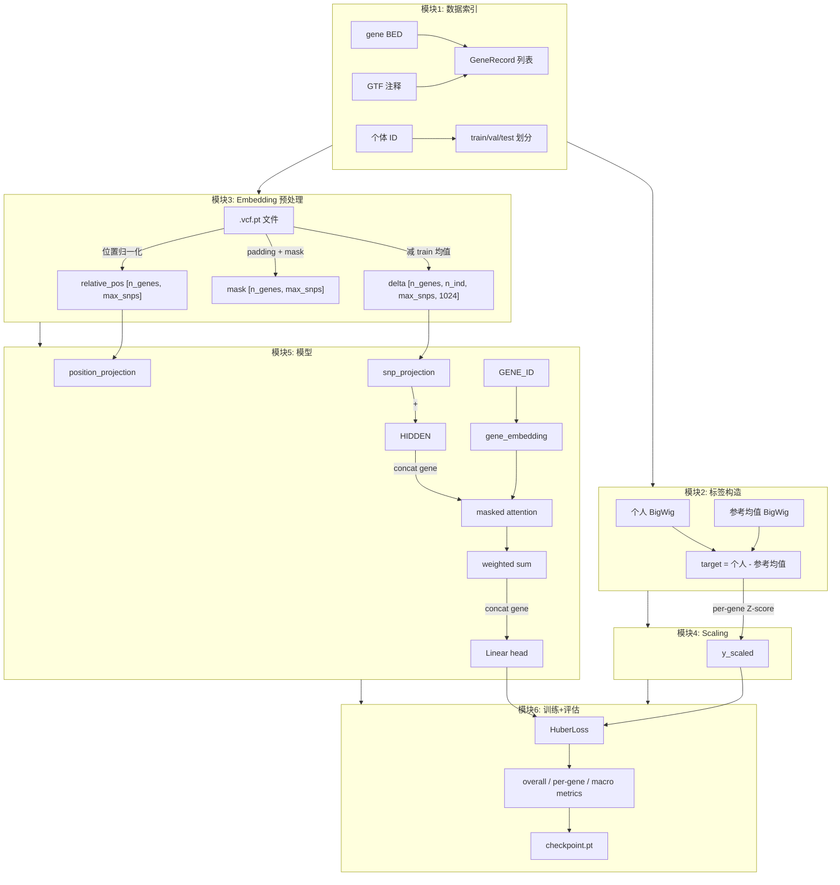

解读xxl的脚本/mnt/rice/default/Workspace/xuxiaolong/human/SNPembedding/run_multi_gene_models.ipynb

## xxl SNP Embedding 多基因模型 —— 架构与逻辑总览

整个系统分 **6 个模块**，按数据流向排列：

---

### 模块 1：数据索引与基因定义

**文件**：notebook Cell 2-3

```
输入:  test.10gene.bed  →  10 个测试基因的基因组坐标
       SNPembedding_res_260708/*/meta.json  →  所有已提取 embedding 的基因列表
       top100_robust_cv_16k_windows.tss_1mb.bed  →  基因优先级排序
       gencode.v49.annotation.sorted.gtf  →  外显子坐标
       101samples.name.txt  →  个体 ID 映射

输出:  GeneRecord 对象
       ├─ chrom, start, end, strand, tss
       ├─ embedding_name  (匹配 embedding 目录名)
       ├─ transcript_id
       └─ expression_regions  (3' 末端外显子坐标, 用于取 BigWig 信号)

基因组织:
  test10_genes  →  固定 10 个基因
  genes_by_size[10]  = test10
  genes_by_size[50]  = test10 + 后续 40 个
  genes_by_size[97]  = 全部 97 个

个体划分:
  train: 81人  |  val: 10人  |  test: 10人
```

**核心职责**：定义"哪些基因、哪些人、基因的区域在哪"。

---

### 模块 2：标签构造（Target）

**文件**：notebook Cell 3 中的 `compute_targets()`

```
对每个基因 × 每个人:

  参考信号 = 81个训练个体的 BigWig 在 3' 外显子区域的均值
  个人信号 = 该个体的 BigWig 在 3' 外显子区域的均值
  
  target = 个人信号 - 参考信号   ← 差分标签

  对 97 基因 × 101 人 = 9797 个 target 值
```

**核心职责**：把 BigWig 轨道信号压缩为一个标量标签（个体偏离群体均值的程度）。

---

### 模块 3：Embedding 加载与预处理

**文件**：notebook Cell 4 中的 `load_hap1_payload()`、`fit_gene_snp_preprocessing()`、`center_and_pad_snp_hidden()`（在 specific_snp_model.py）

```
Step 1: 加载原始 embedding
  从 SNPembedding_res_260708/{gene}/CIMA-{sample}.vcf.pt 读取:
    ├─ hidden_states:  [n_snps, 1024]     ← Genos 在 SNP 位置的 hidden state
    ├─ positions:      [n_snps]           ← 基因组坐标
    └─ variant_keys:   [n_snps]           ← "chr:pos:ref:alt"

  关键约束: 同一基因的所有个体必须有完全相同的 positions 和 variant_keys
           （因为只要有一个 SNP 不同, 矩阵就对不齐了）

Step 2: 减 center（去背景）
  对每个基因:
    center = train 个体的 hidden_states 均值  [n_snps, 1024]
    每个个体的 delta = hidden_states - center  [n_snps, 1024]
    
  含义: 去掉所有个体共有的序列上下文信息, 只保留"这个个体的 SNP 
        对 embedding 造成了什么扰动"

Step 3: Padding + Mask
  max_snps = 所有基因中最大的 SNP 数
  output[gene, individual, :n_snps] = delta    → [n_genes, n_individuals, max_snps, 1024]
  mask[gene, :n_snps] = True                   → [n_genes, max_snps]
  padding 位置填 0

Step 4: 位置归一化
  relative_pos[gene, :n_snps] = (pos-1 - start) / (end-start)  → [n_genes, max_snps]
```

**核心职责**：把每个个体-基因对的 SNP embedding 转换为统一的 `[max_snps, 1024]` delta 矩阵。

---

### 模块 4：Target Scaling

**文件**：`position_binned_model.py` 中的 `fit_gene_target_scalers()`、`scale_gene_targets()`

```
对每个基因单独算:
  mean_train = train 个体 target 的均值
  std_train  = train 个体 target 的标准差

  y_scaled[gene, individual] = (y - mean_train) / std_train

训练完后 inverse:
  y_pred = y_scaled_pred * std_train + mean_train
```

**核心职责**：不同基因的表达量级不同（有的 TPM=500，有的 TPM=5），per-gene Z-score 让所有基因在同一尺度上训练。

---

### 模块 5：模型（SpecificSNPRegressor）

**文件**：specific_snp_model.py

```
输入:  x [B, max_snps, 1024]        ← SNP delta
       snp_mask [B, max_snps]        ← 真实 SNP 标记
       relative_positions [B, max_snps] ← 归一化位置
       gene_ids [B]                  ← 基因索引

四个子模块:

┌─ snp_projection ─────────────────────────────┐
│ LayerNorm(1024) → Linear(1024→64) → GELU     │
│ 把 1024 维 Genos hidden 压缩到 64 维          │
└──────────────────────────────────────────────┘

┌─ position_projection ────────────────────────┐
│ Linear(1→64) → GELU → Linear(64→64)          │
│ 把标量位置映射到 64 维空间, 与 SNP 特征相加    │
└──────────────────────────────────────────────┘

┌─ gene_embedding ─────────────────────────────┐
│ Embedding(n_genes=97, dim=32)                │
│ 每个基因学一个 32 维向量, 相当于基因 ID 的条件化│
│ 注入两处: attention 计算 + 最终 head          │
└──────────────────────────────────────────────┘

┌─ attention + head ───────────────────────────┐
│ attention: (hidden+gene) → score → masked_softmax → weights │
│ pooled = sum(weights * hidden)               │
│ head: concat(pooled, gene_vector) → Linear → 标量 │
└──────────────────────────────────────────────┘
```

**核心职责**：从 97 个基因共享的 SNP delta 中学出每个样本的表达差异。

---

### 模块 6：训练循环与评估

**文件**：notebook Cell 5-6

```
训练:
  optimizer: AdamW(lr=1e-3, weight_decay=0)
  loss:      HuberLoss(delta=1.0)   (用 scaled target)
  scheduler: 无 (靠 early stopping)
  patience:  40 epochs

  每 epoch:
    train:  所有 train 个体
    val:    计算 val_loss (Huber) + macro metrics (pearson, r2)

  保存:
    best_val_state   ← 最低 val loss 的权重
    best_train_state ← 最低 train loss 的权重

评估 (summarize_predictions):
  三个维度:
    overall:  所有样本合并的 pearson / r2 / rmse / mae
    by_gene:  每个基因单独算 → 哪些基因学得好?
    macro:    按基因平均 → 跨基因的宏观指标

  两个 model_state:
    best_validation  → val 上最好, 反映泛化能力
    best_training    → train 上最好, 反映拟合能力
                      (两者差异大 = 过拟合)

Checkpoint 打包 (build_specific_snp_checkpoint):
  保存内容:
    ├─ model_state_dict  (best_val + best_train)
    ├─ model_config      (hidden_dim, n_genes, projection_dim...)
    ├─ ordered_genes     (基因列表 + 坐标)
    ├─ target_scalers    (每个基因的 mean/std)
    ├─ snp_centers       (train 均值, 推理时需要)
    ├─ positions         (SNP 基因组坐标)
    ├─ variant_keys      (SNP ID)
    ├─ splits            (train/val/test 个体)
    └─ training_config   (超参数记录)
```

---

### 架构全景图



---

### 各模块的输入输出速查表

| 模块 | 输入 | 输出 | 形状 | 一次性? |
|------|------|------|------|---------|
| 1 索引 | BED + GTF + name.txt | GeneRecord + splits | — | ✅ |
| 2 标签 | BigWig 文件 | target | [n_ind] per gene | ✅ |
| 3 预处理 | .vcf.pt 文件 | delta, mask, pos | [97,101,~500,1024] | ✅ |
| 4 scaling | target | y_scaled | [97×101] | ✅ |
| 5 模型 | delta+mask+pos+gene_id | 标量 | [B,1] | 训练 |
| 6 评估 | pred + target | metrics + checkpoint | — | 训练 |

模块 1-4 是**离线预处理**，模块 5-6 是**训练时执行**。这意味着你换了基因或换了人，只需要重跑模块 1-4 生成新的预处理数据。