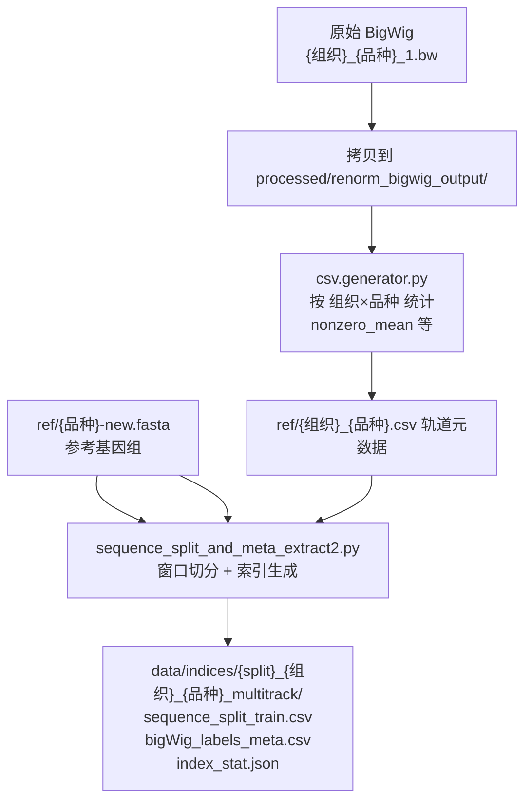

# 基于 OGR（OneGenome-Rice）DNA 基模接下游头的任务总结

> 任务核心：以 **OGR 水稻基因组基模**（1.25B MoE，DNA 大语言模型）为特征抽取器，在其上接入**下游预测头**，实现**单碱基分辨率的多组学信号预测**（重点是 RNA-seq 表达量）。
> 本文档覆盖：基模架构、下游模型架构（单模态 / 多模态融合）、计算流程、技术细节、训练过程、评估与应用。

---

## 一、任务总览

### 1.1 一句话描述

用 DNA 序列（可选加 ATAC-seq 染色质可及性信号）作为输入，预测**逐碱基（single-base resolution）的 RNA-seq 覆盖度信号轨道**，从而把静态基因组"翻译"成动态、组织特异性的表达谱。

### 1.2 任务本质

这是一个 **零膨胀回归（zero-inflated regression）问题**：

- 基因组上 90%+ 位置表达量接近 0，只有基因区间（外显子/UTR/部分增强子区域）有信号；
- 信号动态范围极大（最大值/最小值可 > 10⁵）；
- 输出是**逐碱基连续值**，而非基因级标量，因此要求模型有很高的空间分辨率。

### 1.3 完整流水线（4 步）


| 步骤 | 脚本 | 作用 | 关键输入 → 输出 |
|---|---|---|---|
| ① 数据准备 | `data_prepare.sh` | 轨道准备、窗口切分、生成索引/元数据 | 原始 `.bw` + 参考 `.fasta` → `sequence_split_train.csv`、`bigWig_labels_meta.csv`、`index_stat.json` |
| ② 训练 | `run_train.sh` → `train.py` | DDP 全参/部分微调基模 + 下游头 | indices + index_stat + 基模 → `output/{ts}/checkpoint-*/` |
| ③ 推理 | `run_predict.sh` → `predict.py` | 加载 checkpoint 逐窗口推理 | ckpt + test indices → `*_predictions.csv`（每组织×模态一个） |
| ④ 评估 | `scripts0/evaluation/` | 碱基级 + 片段级指标 | `*_predictions.csv` → `*_track-level_stats.txt`、`.npy` |

---

## 二、OGR 基模（OneGenome-Rice）

### 2.1 定位

OGR 是端到端自监督预训练的**生成式基因组基模**，直接在 DNA 上做**下一碱基预测（NTP）**，学会了 DNA 的"语法"——motif 组合、剪接位点、基因结构、调控元件等。

### 2.2 模型规格

| 规格项 | 参数 |
|---|---|
| 总参数量 | **1.25B**（12 层 × 8 专家 MoE） |
| 激活参数量 | **0.33B**（top-2 路由，只激活 2/8 专家） |
| 架构 | Transformer Decoder + MoE FFN |
| 层数 | 12 |
| Hidden size | 1024 |
| Attention | **GQA**：16 Q heads / 8 KV groups，FlashAttention |
| MoE | **8 专家，top-2**，专家 hidden 4096，SwiGLU |
| 归一化 | RMSNorm（前置，Pre-Norm） |
| 位置编码 | **RoPE，base = 50M**，支持超长上下文 |
| 词表 | 128（padding 到 2^7；实际使用 A/T/C/G/N + 特殊 token 共 ~18 个） |
| 上下文长度 | 最高 **1Mb**（渐进式扩展） |

### 2.3 基模预训练

| 维度 | 细节 |
|---|---|
| 数据 | **QC 过滤的 422 个水稻泛基因组**（栽培稻 + 野生稻祖先，覆盖 Oryza 多样性），公开数据集染色体级 de novo 组装 |
| 编码 | 单碱基 token（A/T/C/G/N + 特殊符） |
| 目标 | 自监督 NTP（input[:, 1:] 即 label），无需人工标注 |
| 框架 | **Megatron-LM**，128 张 GPU |
| 并行策略 | **5D 并行**：TP + PP + CP（上下文并行）+ DP + EP（专家并行） |
| 批量 | Global batch 1024，micro batch 1 |
| 优化器 | AdamW（分布式分片） |
| 学习率 | peak 1e-4，cosine 衰减，5-10% warmup |
| 精度 | BF16 计算，FP32 softmax/梯度/路由 |
| 上下文扩展 | **8K → 32K → 128K → 1M 多阶段递进** |
| 稳定性优化 | MoE 负载均衡 aux loss 1e-3 + router Z-loss 1e-3；grouped GEMM、AllToAll、通信与计算重叠 |
| 本任务所用版本 | `rice_1B_stage2_8k_hf`（stage2 = 32K 继续预训练版，HF 格式，8K 上下文可用） |


---

## 三、下游任务模型架构

有两条技术路线（对应 OGR applications 的 3/4 两个子应用）：

### 3.1 路线 A：DNA-only 单模态（GenOmics）

最常用，`demo/` 与 `applications/3.gene_expression_prediction_of_DNA_sequence/` 即此路线。

```
input_ids [B, L]
  → base（基模，12 层，hidden=1024）
       outputs.last_hidden_state [B, L, 1024]
  → transpose → [B, 1024, L]
  → embedd_proj: Conv1DBlock(1024→proj_dim, k=1)
  → func_genome_UNet（num_downsamples=4 下采样 → bottleneck 1536 → 4 上采样 + 跳跃连接）
       [B, proj_dim, L]
  → output_heads: 每模态一个 Conv1d(proj_dim → num_biosamples)
  → softplus × softplus(scale[i])   （可学习缩放因子，保证输出非负）
  → 逆缩放（×track_mean / 反 squash）→ logits [B, L, num_tracks]
```

**关键组件说明**

| 组件 | 参数/结构 | 作用 |
|---|---|---|
| `base`（基模） | OGR 1.25B，默认全参微调（代码中冻结头默认被注释） | 抽取 DNA 深层表征 |
| `embedd_proj` | 1×1 卷积，1024→proj_dim（1024 或 512） | 通道对齐/降维 |
| `func_genome_UNet` | 每级 Conv1DBlock(k=5, stride=2) 下采样；瓶颈 dilation=2/4；ConvTranspose1d 上采样 + 跳跃连接 | 多尺度感受野，兼顾局部碱基分辨率与长程调控上下文 |
| `output_heads` | `ModuleDict`：每个 assay 一个 `Conv1d(proj_dim, num_biosamples)` | 多任务共通道分离输出 |
| `scale` | `Parameter(zeros(num_tracks))`，经 `softplus` | 逐轨道可学习幅度缩放 |

**多通道布局**（由 `index_stat['counts']` 定义）：

```
num_tracks = len(heads) × len(biosample_order)

例（demo 当前配置，1 模态 × 2 组织 = 2 通道）：
  heads = ["total_RNA-seq_+"]
  biosample_order = ["CSQ", "YG"]
  target_file_name = ["CSQ_P1_1.bw", "YG_P1_1.bw"]
  nonzero_mean = [2.32, 2.20]
  通道 0 = CSQ（+链），通道 1 = YG（+链）
```

### 3.2 路线 B：DNA + ATAC 多模态融合（MultiModalPredictorFusion）

`applications/4.gene_expression_prediction_based_on_multi_modal_data/`。在 DNA 基础上显式加入染色质可及性（ATAC-seq）作为"上下文条件"，预测**链特异性** RNA-seq（+/- 两通道）。

```
输入：input_ids [B,L] + atac_signal [B,L,1]（同窗口 ATAC）
  ├─ DNA 分支：基模 12 层（默认冻结 / 可选解冻最后 1 层）→ [B,1024,L]
  │           dna_downsample Conv1d(stride=4) → [B,1024,L/4]
  ├─ ATAC 分支：ATAC_TransformerEncoder（6 层，d_low=192，4 heads，
  │            RoPE 与 DNA 对齐，θ 取自基模 config）→ [B,1024,L]
  │            Conv 金字塔 enc1/enc2/enc3 → [B,1024,L/4]
  ├─ L/4 分辨率双向交叉注意力：
  │     cross_a2d = CrossAttn(q=ATAC, kv=DNA)
  │     cross_d2a = CrossAttn(q=DNA, kv=ATAC)
  ├─ 4-way 门控融合（token-wise）：
  │     w = softmax(MLP([atac_self; dna_self; cross_a2d; cross_d2a]))
  │     fused = Σ w_i · feat_i
  ├─ post_fusion 瓶颈（卷积 3 层，dilation 1/2/4）
  ├─ U-Net 上采样（L/4 → L/2 → L），与 ATAC 金字塔各层跳跃拼接
  ├─ 全分辨率 dual-skip 门控注入：
  │     skip_w = softmax(Conv1d([dec2; dna_skip; atac_skip]))
  │     merged = dec2 ⊕ (skip_w·dna_skip + skip_w·atac_skip)
  └─ final head（512→256→2，dilation 1/2/4）→ softplus × softplus(scale)
```

**设计动机**：DNA 编码"潜力"（序列决定的可能性），ATAC 编码"上下文状态"（当前细胞/组织里哪些区域被开放），二者融合后预测真正的表达——把序列型调控与环境型调控解耦。

**损失**：MSE 为主体，可选加融合门/跳跃门**熵正则项**（以 MSE 的固定比例为权，`-mse.detach() × frac × H/log(K)`），鼓励门控使用更均匀且不影响 MSE 梯度。

---

## 四、计算流程（数据 → 训练 → 推理 → 评估）

### 4.1 ① 数据准备 `data_prepare.sh`



| 产物 | 内容 |
|---|---|
| `sequence_split_train.csv` | 窗口索引（列 `chromosome,start,end`，0-based half-open），**32768 bp 窗口、16384 bp 步长（50% overlap）** |
| `bigWig_labels_meta.csv` | 每条轨道标签元数据（`target_file_name`/`biosample_name`/`strand`/`nonzero_mean`…） |
| `index_stat.json` | **训练/推理核心配置**：`inputs`（genome_fasta、processed_bw_dir、window_size、overlap…）、`counts`（heads 模态、biosample_order 组织、target_file_name 轨道、nonzero_mean、num_samples…） |

**数据划分约定**：按"品种"划分——训练品种（如 P1/P4/P6/P11）的染色体全量入 train split，验证品种（P7）、测试品种（P11）入对应 split，避免同一品种染色体泄露。

**（路线 B 额外）从原始 reads 起步**：
- ATAC：Trimmomatic 修剪 → PE 合并 SE → Bowtie2 单端比对 → samtools stats → bamCoverage 风格覆盖度（MAPQ≥30，bin=1，RPGC 归一化）
- RNA：HISAT2 双端比对 → 链特异性 bamCoverage（CPM 归一化），输出 +/- 链两条 BigWig

### 4.2 ② 训练 `train.py`

**启动方式**：`run_train.sh` → `torchrun`（DDP）+ HF `Trainer` 子类。

```shell
torchrun --nnodes 1 --nproc_per_node {N} train.py \
    --model_path  rice_1B_stage2_8k_hf \
    --sequence_split_train_multi  data/indices/train_*_multitrack/sequence_split_train.csv \
    --sequence_split_val          data/indices/valid_*_multitrack/sequence_split_train.csv \
    --index_stat_multi_json       data/indices/train_*_multitrack/index_stat.json \
    --nonzero_means 1.864 1.879 \
    --train_chromosomes Chr09 --val_chromosomes Chr09 \
    --output_base_dir output/$(date +%Y%m%d%H%M) \
    --lr 5e-5 --batch_size_per_device 1 --gradient_accumulation_steps 10 \
    --num_train_epochs 20 --loss_func mse --max_sequence_length 32768 \
    --use_flash_attn --gpus_per_node $N --use_wandb
```

**训练超参与工程细节**

| 项 | 值 | 说明 |
|---|---|---|
| 分布式 | DDP（NCCL / MCCL 国产卡） | `setup_distributed()` 自动判单卡/多卡 |
| 精度 | **BF16** + FlashAttention-2 | `config._attn_implementation = "flash_attention_2"` |
| 优化器 | **Adafactor** | 内存友好，适合大模型微调 |
| LR 调度 | cosine，warmup 10% | `warmup_ratio=0.1` |
| 正则 | weight_decay 0.01，max_grad_norm 1.0 | |
| 数据加载 | `num_workers=4`、persistent+pin_memory | BigWig 随机读取是主要瓶颈 |
| BatchNorm | **SyncBatchNorm（节点内分组同步）** | 大 batch 归一化更稳 |
| 每卡 batch | 1 × 10 累积 × 8 卡 = 有效 batch 80（窗口 32K bp） | 显存敏感 |
| 每 epoch 保存 | `save_strategy="epoch"`，`save_safetensors=True` | 产出 `.safetensors` |
| 日志 | wandb / swanlab + JSONL | 自定义 `CustomTrainer` 记录**每个模态/组织的分头 loss**（`loss_total_RNA-seq_+` 等），经 all_reduce + grad_accum 缩放后与主 loss 对齐 |
| 恢复 | `--ckpt_dir` 断点续训 | HF 全套 state（optimizer/scheduler/rng） |

**训练时数据流（每步）**：

```
DataLoader 批(1×32768×2 轨道)
  → tokenizer: DNA → input_ids [B, L]
  → pyBigWig: 信号 → labels [B, L, num_tracks]
  → scale: targets_scaling_torch(labels / nonzero_mean, ^0.75 squash, >10 裁剪)
  → GenOmics forward → logits [B, L, num_tracks]
  → _compute_loss：按 assay 分片 MSE（支持 poisson / tweedie / poisson-multinomial）
  → 汇总 total_loss；predictions_scaling_torch 逆变换用于调试/可视
  → backward（accum 缩放）→ step
```

**目标缩放公式**（Enformer 风格，向量化实现）：

$$y_{\text{scaled}} = \begin{cases} \left(\dfrac{y}{\mu}\right)^{0.75}, & \left(\dfrac{y}{\mu}\right)^{0.75} \le 10 \\[6pt] 2\sqrt{10\left(\dfrac{y}{\mu}\right)^{0.75}} - 10, & \text{otherwise}\end{cases}$$

其中 $\mu$ = 轨道非零均值（`nonzero_mean`），`apply_squashing` 对 ATAC 轨道关闭。预测侧做严格逆变换并 `nan_to_num`。

### 4.3 ③ 推理 `predict.py`

- 用 `load_finetuned_model` 直接从 `.safetensors` 在目标 GPU 上重建 `GenOmics`（读 index_stat 恢复轨道结构），BF16 加载；
- `DistributedSampler(shuffle=False)` 按秩切分测试窗口，`torch.no_grad()` 推理；
- 输出**每组织×模态一个 CSV**：`{biosample}__{modality}_predictions.csv`，列含 `chromosome,start,end,predicted_expression,true_expression`（含序列列可选）；
- 多卡阶段并行写 `tmp_rank_{r}/`，主进程合并排序去重后落盘；
- 支持滑动窗口批量（`--batch_size 3 --num_workers 8`）、`--max_predict_samples` 调试限制。

### 4.4 ④ 评估

| 层级 | 脚本 | 指标 |
|---|---|---|
| 碱基级 | `calc_metrics_for_batch_bw2.py` | 全基因组逐碱基：**Pearson / Spearman / R² / MSE / MAE / log1p-Pearson**；零膨胀：**zero AUROC / zero AUPRC / nonzero AUPRC**；**nonzero 区域**单独指标（MSE/MAE/Pearson/Spearman） |
| 片段级 | `csv_seg_eval.py` | 按基因/窗口片段聚合后的相关性分析 |
| 转换 | `csv2bw2.py` | 预测 CSV → BigWig / `.npy`（供 wig 浏览器与下游做差异表达分析） |
| 差异表达 | `diff_exp_analysis_for_single_*.py` | 突变/品种间的表达差异显著性比较 |

**指标要点**：由于 90%+ 位置为 0，整体 Pearson 会被 0 主导；因此** nonzero 区域指标与 zero AUROC 才是区分模型质量的关键**（能否既判"哪里表达"又测准"表达多少"）。

---

## 五、结果与评测亮点（路线 B 已公开）

- 测试集**单碱基 PCC 平均 0.94**（0.936–0.954）——模型抓住了 RNA 表达的相对丰度与空间分布；
- **R² 波动较大（0.50–0.97）**——绝对量级恢复困难，尤其动态范围 >10⁵ 的数据；
- 说明染色质架构与 DNA 序列的互作模式可以被该多模态架构有效捕获；OGR 作为 DNA 编码器在融合架构中是有效的信息算子。

---

## 六、应用场景

1. **顺式调控变异效应预测**：输入参考/突变 DNA 窗口，对比预测轨道，定位致表达变化的 SNP/结构变异；
2. **等位基因特异表达（ASE）建模**：利用单碱基分辨率输出比较两个等位基因的预测信号；
3. **突变模拟（in silico perturbation）**：如 `TAC1_inference.ipynb`——水稻分蘖角度基因 TAC1 的参照与突变体序列同时推理，对比同一区段不同突变的表达预测（配 `src/viewer.py` 轨迹可视化）；
4. **转录组指导的育种设计**：新品种（如 P1/P4/P6/P11 之外）基因组直接推理表达谱，无需实验。

---

## 七、技术要点速查

| # | 要点 | 细节 |
|---|---|---|
| 1 | 上下文窗口 | 32,768 bp（窗口）/ 16,384 步长，与基模 stage2 的 32K 上下文对齐 |
| 2 | 输出分辨率 | 每碱基 1 个值 ⇒ 卷积核全为 k=1 或 padding 保持长度，U-Net 下采样最大到 L/16 后还原 |
| 3 | 通道语义 | 通道 = 模态 × 组织，由 `index_stat.json` 驱动，训练/推理/评估全程一套元数据 |
| 4 | 国产卡支持 | `run_train.sh mx`：MACA 环境（MCCL、mx-smi 探测、TF32 关闭、expandable segments），swanlab 替代 wandb |
| 5 | 损失可切换 | `mse`（默认）/ `poisson` / `tweedie`（p=1.2，复合泊松-伽马，适合零膨胀正数）/ `poisson-multinomial`（组内多伯努利+泊松总量，支持 `multinomial_resolution` 分块） |
| 6 | 多数据集训练 | `--sequence_split_train_multi` 支持通配符合并多品种，要求各数据集轨道结构一致，`nonzero_means` 手工覆盖 |
| 7 | 冻结策略 | 代码预留"冻结全部 + 解冻最后 1 层"开关（当前默认全参微调）；路线 B 默认冻结基模、可解冻最后 1 层 |
| 8 | 显存 | 32K 窗口 × batch 1 × 8 卡全参微调约 41GB/GPU（64GB 卡安全）；16 卡时 accum 减半保全局 batch |

---

## 八、代码结构

```
applications/3.gene_expression_prediction_of_DNA_sequence/   (demo/ 为实际运行拷贝)
├── data_prepare.sh          # ① 数据准备（入口）
├── run_train.sh / train.py  # ② 训练（DDP + CustomTrainer）
├── run_predict.sh / predict.py  # ③ 推理
├── scripts/
│   ├── data_preprocess/     # renorm_bigwig / sequence_split_and_meta_extract2 / 建索引
│   └── evaluation/          # csv2bw2 / calc_metrics_for_batch_bw2 / csv_seg_eval
└── src/
    ├── model.py             # GenOmics、func_genome_UNet、损失函数、缩放函数
    ├── dataset.py           # MultiTrackDataset（多数据集、惰性 FASTA/BigWig 句柄）
    ├── trainer.py           # CustomTrainer（DDP、per-head loss 聚合）
    ├── metrics.py           # 零膨胀回归评估
    ├── viewer.py            # 轨道可视化 / 突变对比
    └── util.py              # DDP 初始化、SyncBatchNorm、seed、日志

applications/4.gene_expression_prediction_based_on_multi_modal_data/   (路线 B)
├── run.py                  # YAML 驱动端到端编排（训练→推理→指标）
├── training.py / inference.py
└── model/
    ├── predictor_fusion.py # MultiModalPredictorFusion（交叉注意力 + 门控融合）
    ├── encoder_transformer.py # ATAC Transformer 编码器（RoPE）
    └── pipeline.py / dataset.py / index.py / scaling.py ...
```

---

## 九、参考资料

- OGR 基模 README：`OneGenome-Rice/README.md`（1.25B MoE / 422 泛基因组 / Megatron-LM 5D 并行）
- 基模架构细节：`gene_expression_prediction/doc/基模架构.md`（12 层内部数据流、token 词表、PT→CPT）
- 单模态应用：`applications/3.../README.md`、`deepseek-intro.md`
- 多模态应用：`applications/4.../README.md`、`senario.md`（PCC 0.94 评测）
- 数据出处：Zhu, T. et al. (2024) *Comprehensive mapping and modelling of the rice regulome landscape…* Nat. Commun. 15, 6562