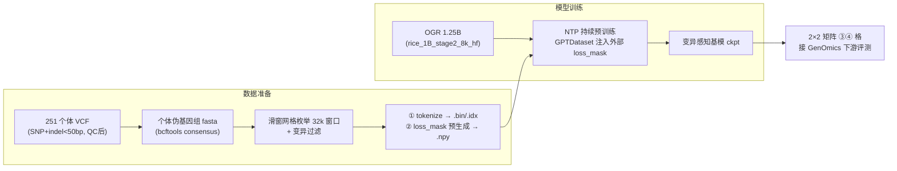

# 水稻变异感知 NTP 微调实现文档（A2 × M2）

> 目标：在 OGR 1.25B（MoE 8 experts / top-2）上，用**群体变异信息**做变异感知的下一步预测（NTP）持续预训练，得到"变异感知基模"，供 2×2 实验矩阵的 ③④ 格（群体微调后冻结/不冻结）使用。
>
> 核心机制：**样本(A2) 滑窗网格 + 变异过滤 × 微调(M2) 变异感知 loss_mask**。不配对（ref/alt），单序列范式。
>
> 前置文档：`variant_aware_pretraining_plan.md`（2×2 矩阵 + 科学假设）、记忆 `variant-injection-plan.md`（UKBioBERT 注入方案）
>
> 状态：**完整计划** · 2026-08-28（含代码改动清单、卡时估算、执行顺序）

---

## 一、总览



**核心改动只有两处（都在数据侧为主）**：
1. **数据准备**：给每个训练窗口预生成一份**变异感知 loss_mask**（32768 长度权重向量），存 `.npy`
2. **dataset 注入**：`GPTDataset.__getitem__` 里用外挂 loss_mask **覆盖默认全 1 mask**（改动 ~5 行）

模型架构、`loss_func` 公式、训练循环**全部不动**。

### 代码改动清单（精确到文件）

| # | 文件 | 改动 | 性质 | 预估工作量 |
|---|---|---|---|---|
| 1 | **新脚本** `generate_variant_windows.py` | 滑窗网格枚举（step=16384）+ 变异过滤 + 窗口清单 CSV + 生成 `loss_masks.npy` | 新建 | 1–2 天 |
| 2 | **新脚本** `run_variant_ntp.sh` | 复制 `AgriGenome_1B_stage2_8k.sh`，改 seq/lr/data/load | 新建 | 0.5 天 |
| 3 | `megatron/core/datasets/gpt_dataset.py` | `__init__` 加载外部 npy；`__getitem__` shuffle 后覆盖 mask（~10 行） | 小改 | 0.5 天 |
| 4 | （可选）`preprocess_data.py` | 若 eod 行为需调整（见 §4.3 坑1） | 微调 | 0.5 天 |
| 5 | `pretrain_gpt.py` / `loss_func` | **不改**（现有 loss_mask 加权公式天然支持） | — | — |

**核心改动只有 gpt_dataset.py 的 ~10 行**，其余是数据侧新脚本 + 训练启动脚本。

---

## 二、数据准备（M0）

### 2.1 输入数据与 QC

来源：商连光 251 材料（`/mnt/rice/data/Lianguang_shang/`，见 `doc/shang_data.md`）

| 输入 | 说明 |
|---|---|
| SNP VCF（36G） | 主数据 |
| SV VCF（1.7G） | **本阶段不用**（过滤，避免破坏坐标对齐） |
| 参考基因组 | 现有 `ref/{品种}-new.fasta` 或 IRGSP-1.0（需与 VCF 坐标系一致） |
|（可选）泛基因组 | OGR 422 组装（`OGR_data.csv` 清单），`--blend` 混合 |

**QC 规则**（沿用 UKBioBERT 方案）：

```bash
# 1) 变异类型过滤：SNP + indel<50bp
bcftools view -v snps -i 'MAX(INFO/SVLEN)<=50' 251.SNP.vcf.gz -o 251.snps_indels.vcf.gz

# 2) 群体遗传 QC：MAF / HWE / 缺失率
plink2 --vcf 251.snps_indels.vcf.gz \
       --maf 0.05 --hwe 1e-6 --geno 0.1 \
       --make-pgen --out 251_qc
```

- 过滤大 SV/CNV/转座子——避免破坏参考坐标系的固定窗口对齐
- **染色体隔离**：train (chr1-7) / val (chr8-9) / test (chr10-12)，测试染色体变异全程 unseen（防 LD 泄露）

### 2.2 个体伪基因组构建

```bash
# 对每个个体 i，把其基因型的 Alt 碱基打回参考序列
bcftools consensus -f ref.fasta -s {个体ID} -o {个体ID}.fasta 251_qc.vcf.gz
```

- SNP 等长替换；短 Indel 用 `-` 填充/尾部截断，强制固定 32k 窗口
- 窗口内 N 占比 > 1% 丢弃（Beagle/Impute5 填充到 >99% 完整度）

### 2.3 滑窗网格枚举窗口 + 变异过滤（A2）—— 免去重的采样方案

> 采用与下游 `data_prepare.sh` 一致的**固定滑窗网格**，天然无重复窗口，无需去重。

```
对每个个体、每条染色体：
    按 step = 16384 枚举所有 32768 bp 窗口（网格，坐标唯一）
    只保留"窗口内含 ≥1 个 QC 变异位点"的窗口
    窗口内所有变异位点都计入 loss_mask 加权（不只一个）
```

**为什么免去重**：窗口坐标是固定整数网格（`[0,32768), [16384,49152), ...`），每个窗口唯一存在。相比"以变异位点为中心"方案（变异密集区会产生大量 99% 重叠的窗口需要去重），此方案直接结构性消除重复。

**窗口内容语义**：

```
┌────────────── 32,768 bp 窗口 ─────────────┐
│  背景       │ v1  v2  背景 │ v3 │  背景    │
│  (w=0.1)   │  3.0/1.5     │3.0 │         │
└────────────────────────────────────────────┘
  每个变异位点 v 在 loss_mask 中都有对应高权重位置
```

**同一染色体窗口可 overlap**（step 16k < 32k 窗口，天然 50% overlap），与下游一致。

### 2.4 生成 loss_mask（M2）—— 预生成到 .npy

对每个窗口，生成长度 32768 的权重向量 **（静态数据，数据准备阶段一次性算好）**：

| 位置 | 权重 | 语义 |
|---|---|---|
| 变异位点前一位 `p`（即预测变异位点的位置） | **3.0** | 学"左侧 32k 上下文 → 该位点等位基因" |
| 变异位点 ±6~15 bp motif 区域 | **1.5** | 学"变异对局部调控语法的破坏" |
| 其余背景位置 | **0.1** | 保留 OGR 知识，防参考序列主导 |

> ⚠️ NTP 细节：`loss_mask[i]` 加权的是"位置 i 预测的 next-token（= 位置 i+1 碱基）"。变异位点 v 在窗口 index `q`，则 `loss_mask[q-1] = 3.0` / 变异位点多个则对应多个位置加权。

**产出**（与 .bin token 流样本顺序严格一致）：

```
{个体ID}, {染色体}, {窗口start}, {窗口end}, [变异位点index列表], {loss_mask.npy 行号}
```

`loss_masks.npy`：shape = `[num_samples, 32768]`，float32。

### 2.5 tokenize 成 Megatron 格式

复用 `preprocess_data.py` + tokenizer `one_hot.bpe.model`：

```bash
python preprocess_data.py \
    --input variant_windows.jsonl \
    --output-prefix variant_ntp \
    --tokenizer-type SentencePieceTokenizer \
    --tokenizer-model /mnt/rice/tokenizer/one_hot.bpe.model \
    --append-eod --workers 8
```

产出 `variant_ntp_text_document.{bin,idx}` + 对齐的 `loss_masks.npy`。

---

## 三、loss_mask 如何注入（代码层对接）⭐

### 3.1 Megatron 默认机制（实证，`gpt_dataset.py`）

`loss_mask` **不是**在训练时现场算的，而是 **dataset 的 `__getitem__` 产出、随样本一起进 batch**：

```python
# GPTDataset.__getitem__（核心行）
text, _ = self._query_document_sample_shuffle_indices(idx)   # 切出 32k 窗口 token
tokens = text[:-1];  labels = torch.roll(text, shifts=-1)     # NTP 的 shift
attention_mask, loss_mask, position_ids = _get_ltor_masks_and_position_ids(...)
#   ↑ 默认 loss_mask：全 1（有效位）+ 0（eod / padding）
loss_mask[labels == self._pad_token_id] = 0.0   # padding 位置 = 0
```

### 3.2 我们的注入方式

**在 `__getitem__` 里用外挂 `loss_masks.npy` 覆盖默认 mask**（改动小）：

```python
# GPTDataset.__init__ 新增：
self.external_loss_masks = np.load('/path/to/loss_masks.npy')  # [num_samples, 32768]

# __getitem__ 里，拿到原始样本 idx 后覆盖：
#   ⚠️ 注意 shuffle_index：idx 已经过乱序映射，需用映射后的 idx 索引外部数组
idx = self.shuffle_index[idx] if self.shuffle_index is not None else idx
...
# 默认 loss_mask 生成后：
loss_mask = torch.from_numpy(self.external_loss_masks[idx]).float()
# 再用既有逻辑兜底 padding/eod：
loss_mask[labels == self._pad_token_id] = 0.0
```

**实现要点**：
1. 外部 `.npy` 的行号 = **dataset 构建时样本的真实顺序**（= `.bin` 的 token 流顺序），与 `shuffle_index` 对齐
2. 必须在 `idx = self.shuffle_index[idx]` **之后**用 idx 索引外部数组（否则乱序后 mask 与序列错位）
3. 训练侧 `loss_func` **一行不改**（`loss = torch.sum(losses * loss_mask)` 公式不变）

### 3.3 备选路径

若 Megatron 侧 `--loss-mask-tokens`（原启动脚本已有该参数）支持"指定 token 参与 loss"，可进一步在命令行层面实现部分权重；但**加权（3.0/1.5/0.1）仍需外部 mask 数组**，故以 3.2 为主。

---

## 四、模型训练（M1）—— NTP 持续预训练

### 4.1 训练配置（基于 `AgriGenome_1B_stage2_8k.sh` 修改）

```bash
#!/bin/bash
# run_variant_ntp.sh

export CUDA_DEVICE_MAX_CONNECTIONS=1
export PYTORCH_CUDA_ALLOC_CONF=expandable_segments:True

# ======== 关键改动（较原预训练）========
WANDB_NAME=OGR_variant_ntp_stage2_8k
SEQ_LENGTH=32768                    # ← 32k 与下游对齐
MICRO_BATCH_SIZE=1
GLOBAL_BATCH_SIZE=1024
TRAIN_SAMPLES=5242880               # ~5120 步（5M/1024）
CHECKPOINT_PATH=/mnt/rice/.../$WANDB_NAME
# ==================================

# MODEL_ARGS / MOE_ARGS 与原脚本一致（12层/1024/GQA16:8/RoPE base=50M/
# 8 experts top-2/aux 1e-3/z-loss 1e-3/alltoall/grouped-gemm）

DATA_ARGS=" \
    --num-workers 8 \
    --dataloader-type cyclic \
    --tokenizer-type SentencePieceTokenizer \
    --tokenizer-model /mnt/rice/tokenizer/one_hot.bpe.model \
    --data-path /mnt/rice/variant_ntp/variant_ntp_text_document \
    --split 1000,0,0 \
    --loss-mask-tokens N \
    --no-create-attention-mask-in-dataloader"

TRAINING_ARGS=" \
    --micro-batch-size ${MICRO_BATCH_SIZE} \
    --global-batch-size ${GLOBAL_BATCH_SIZE} \
    --lr 1e-5 \                     # ← 低 LR 防遗忘（原 9.6e-5）
    --train-samples ${TRAIN_SAMPLES} \
    --lr-decay-style cosine \
    --min-lr 1e-6 \
    --weight-decay 0.1 \
    --lr-warmup-fraction 0.05 \
    --clip-grad 1.0 \
    --bf16 --use-flash-attn \
    --attention-softmax-in-fp32 \
    --load /mnt/rice/AgriGenome_1B_stage2_8k/..."  # ← 从 OGR stage2 续训

# MODEL_PARALLEL_ARGS / LOGGING_ARGS 与原脚本一致
```

### 4.2 训练要点

| 项 | 值 | 理由 |
|---|---|---|
| 初始化 | `rice_1B_stage2_8k_hf`（`--load`） | 复用 422 泛基因组知识 |
| LR | peak 1e-5 | 防灾难性遗忘 |
| 步数 | ~5000 步（先 100 步冒烟） | 变异是"精细调"非"重学" |
| 上下文 | 32768 | 与下游对齐 |
| MoE aux/z-loss | 保留 1e-3 | 专家负载均衡 |
| loss_mask | 3.0 / 1.5 / 0.1 | 核心机制 |
| 监控 | 变异位点区 loss（mask=3.0） | 验证在学变异 |

### 4.3 与 loss_func 对接

`pretrain_gpt.py` 现有 loss_func 已经是加权求和：

```python
def loss_func(loss_mask, output_tensor, model=None):
    losses = output_tensor.view(-1).float()
    loss_mask = loss_mask.view(-1).float()
    loss = torch.sum(losses * loss_mask)   # ← 公式不变，loss_mask 已换成变异感知权重
    num_tokens = loss_mask.sum()
    return loss, num_tokens, ...
```

---

## 4.4 训练资源估算（A100-80G）

### 4.4.1 两步走策略

| 阶段 | 目的 | 规模 | 判定标准 |
|---|---|---|---|
| **冒烟测试**（先行） | 验证 loss_mask 注入正确、无 NaN、变异区 loss 有下降趋势 | 100–300 步，8 卡 | 变异区 loss 降、背景 loss 平、mask 与序列对齐 |
| **正式训练** | 产出变异感知基模 | 2000–5000 步（视冒烟收敛曲线定） | 变异区 loss 收敛 → 进 2×2 矩阵 |

> 强烈建议先冒烟再正式——100 步冒烟能暴露 90% 的管线错误，成本仅正式训练的 2%。

### 4.4.2 并行配置

| 配置 | 卡数 | 说明 |
|---|---|---|
| 冒烟 | 8 卡 A100 | TP=1, PP=1, EP=1（纯 DP，与原脚本一致），GB=256 |
| 正式-低配 | 8 卡 | 同上，GB=256–512 |
| 正式-中配（推荐） | 16 卡 | GB=512 |

原预训练脚本即 `TP=1 PP=1 EP=1`（纯数据并行 + 分布式优化器）。1.25B 全参 BF16 ≈ 2.5GB/卡，8 卡复制放得下，MoE 不做专家并行也能跑——最省事、最贴合原栈。

### 4.4.3 卡时估算

**估算公式**：

$$\text{每步 FLOPs} = 6 \times N_{\text{active}}(0.33B) \times (\text{GB} \times 32768)$$

$$\text{耗时/步} = \frac{\text{每步 FLOPs}}{\text{卡数} \times 0.25 \times 312\text{ TFLOPS}}$$

- A100-80G BF16 峰值 312 TFLOPS；MoE alltoall + 32k 长序列下 **MFU 保守按 25%** 计

| 场景 | 卡数 | GB | tokens/步 | 每步耗时(估) | 总步数 | 总耗时 | 卡时 |
|---|---|---|---|---|---|---|---|
| 冒烟 | 8 | 256 | 8.4M | ~26 s | 200 | **~1.5 h** | 12 |
| 正式-低配 | 8 | 256 | 8.4M | ~26 s | 3000 | **~22 h** | 176 |
| 正式-低配 | 8 | 512 | 16.8M | ~52 s | 5000 | **~72 h (3天)** | 576 |
| 正式-中配 | 16 | 512 | 16.8M | ~26 s | 5000 | **~36 h (1.5天)** | 576 |

**结论区间**：

> 5000 步、GB=512 正式训练 ≈ **576 卡时**（8 卡 3 天 / 16 卡 1.5 天）；GB=256 减半（~290 卡时）；冒烟仅 **~12 卡时**。

### 4.4.4 卡时校准（必做）

> ⚠️ 以上为理论值，**必须用冒烟实测校准**：记录前 10–30 步的实际步耗时，用 `实际步耗时 × 目标步数` 外推总时间。MoE 通信和 32k attention 对 MFU 影响大，实测可能落在 ±50% 区间。

### 4.4.5 显存可行性（32k 在 A100 上可行）

| 项 | 估算 | 说明 |
|---|---|---|
| 模型权重（1.25B 全参） | 2.5 GB | BF16，每卡全量复制（DP） |
| 梯度 | 2.5 GB | |
| 优化器状态（分布式分片/8卡） | ~2 GB | AdamW fp32 master 分片 |
| 激活（32k seq × micro-batch 1） | ~8–15 GB | flash-attn 省 attention 矩阵 |
| **每卡合计** | **~15–22 GB** | A100-80G 充裕，micro-batch 可上 2 |

---

## 五、产出与验证

### 5.1 产出

```
/mnt/rice/OGR_variant_ntp_stage2_8k/{checkpoint-500, checkpoint-1000, ...}
```

### 5.2 冒烟验证（训练时）

| 检查 | 预期 |
|---|---|
| 变异位点区 loss（mask=3.0） | 单调下降 |
| 背景区 loss（mask=0.1） | 基本持平（未遗忘） |
| MoE aux/z-loss | 稳定（负载均衡未崩） |
| 梯度 clip | 无 NaN/Inf |
| mask 与序列对齐抽查 | 人工看 1-2 个样本的变异位点与 mask 位置对应 |

### 5.3 进 2×2 矩阵评测

产出基模 → 作为 ③④ 格 backbone → 接 GenOmics 下游 → 跑评测①②③（表达 / ISM-eQTL / 功能 embedding），与 ①（原始 OGR 冻结）②（原始端到端）对比。

---

## 六、工程风险与缓解

### 6.0 两个必须提前确认的工程坑

1. **eod 切分坑**：若 `preprocess_data.py` 用 `--append-eod`，每个 32k 窗口尾部会加 eod token → 长度变 32769 > seq_length 32768，可能被 GPTDataset 切成两段破坏窗口边界。**需先确认 preprocess 的 eod 行为**，必要时窗口取 32767 + eod，或按 document 对齐切分。
2. **`--loss-mask-tokens N` 语义**：原脚本已有此参数，需查 Megatron 源码确认是否已支持"定制 loss mask token 集"——若支持，部分工作可下沉到命令行，实现更稳。

| 风险 | 缓解 |
|---|---|
| 251 个体少，无增益 | 低 LR 短训 + `--blend` 422 泛基因组；零结果也有价值（H0） |
| 灾难性遗忘 | 低 LR + 短训 + 背景区 loss 监控 |
| 测序错误/缺失 | N>1% 丢弃 + 填充 |
| loss_mask 与序列错位（shuffle） | 用 `shuffle_index` 映射后的 idx 索引外部数组；冒烟抽查 |
| 外部 .npy 内存 | 32k × 4B = 128KB/样本；万级样本 ~1-2GB，可 mmap |
| MoE 漂移 | 保留 aux/z-loss |
| 测试染色体泄露 | 染色体隔离全程 unseen |

---

## 七、执行计划（完善版）

### 7.1 阶段时间线

| 阶段 | 内容 | 周期 | 产出 |
|---|---|---|---|
| M0a | VCF QC + 伪基因组构建 | 3-5 天 | 251 个体伪基因组 fasta |
| M0b | 滑窗枚举 + loss_mask 预生成 + tokenize | 3-5 天 | 窗口清单 + loss_masks.npy + .bin/.idx |
| M0c | post-hoc ISM 基线（并行） | 2 天 | 方向准确率基线（判断 OGR 现有敏感性） |
| M1s | 冒烟训练 100-300 步（8 卡） | 0.5-1 天 | 校验管线 + 卡时实测 |
| M1 | NTP 变异感知预训练 2000-5000 步 | 1-3 天 | 变异感知基模 ckpt |
| M2 | 2×2 矩阵四格 + 评测①② | 2-4 周 | 对比结果表 |
| M3 | 评测③ + 结论 H1/H0 | 1-2 周 | 论文/报告 |

### 7.2 严格执行顺序（含门禁）

```
① 查 --loss-mask-tokens 语义 + eod 行为        （0.5 天）
     │ 门禁：确认注入路径
② 写 generate_variant_windows.py                 （1-2 天）
     │ 门禁：窗口清单 + loss_masks.npy 对齐抽查通过
③ 改 gpt_dataset.py 注入                         （0.5 天）
     │ 门禁：单样本加载后 mask 与序列变异位点对齐
④ 10 步裸测：记录实际步耗时 → 校准卡时           （1 小时）
⑤ 冒烟 200 步：验证 loss 趋势 + mask 对齐        （1.5 小时）
     │ 门禁：变异区 loss 降 / 背景 loss 平 / 无 NaN
⑥ 正式训练 3000-5000 步                         （1-3 天）
     │ 门禁：变异区 loss 收敛
⑦ 产 ckpt → 进 2×2 矩阵 ③④ 格评测               （M2-M3）
```

---

## 八、待确认事项

| # | 事项 | 影响 | 负责人 |
|---|---|---|---|
| 1 | 251 VCF 坐标系 vs 参考 fasta | 是否 liftover | 数据侧 |
| 2 | 转录组覆盖度 | 评测①样本量（预训练不依赖） | 数据侧 |
| 3 | `--loss-mask-tokens N` 的确切语义 | loss_mask 是否可部分走命令行 | 工程侧 |
| 4 | GPU 预算与可用窗口期 | 卡时区间：冒烟 12 / 正式 176–576 | 资源侧 |
| 5 | 是否 blend 422 泛基因组 | 数据预处理量 | 数据侧 |
| 6 | 外部 loss_mask 注入的工程量 | 需确认 GPTDataset 版本（mcore 新旧） | 工程侧 |