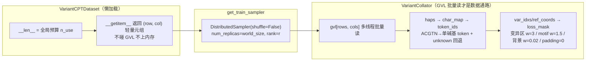

# OGR 变异感知 CPT 微调方法总结（含 Dataloader 全链路）

> 配置驱动：`run.sh <config.yaml> [all|data|model] [smoke]`
> 核心代码：`src/trainer_utils.py`（Trainer）、`src/variant_dataset.py`（Dataset/Collator）、`src/window_sampling.py`（采样）、`src/model_head.py`（Loss）

---

## 1. 整体流水线

```mermaid
flowchart LR
    A["FASTA + VCF 251 样本"] -->|"GVL 构建"| B["GVL 二元矩阵<br/>region × sample × 单碱基"]
    B -->|"build_index_pairs"| C["(row, col) 索引对<br/>窗 × 样本 全展开"]
    C -->|"采样策略"| D["覆盖段 + 聚焦段索引列表"]
    D -->|"VariantCPTDataset 懒加载"| E["DataLoader"]
    E -->|"VariantCollator GVL 批量读"| F["token_ids + loss_mask"]
    F -->|"VariantAwareCausalLM"| G["加权 NTP Loss<br/>Σw·CE / Σw"]
```

| 阶段 | 入口 | 运行 | 产物 |
|---|---|---|---|
| 数据预处理 | `run.sh cfg data` | CPU | `output/<data>/gvl/*.gvl` + bed/norm |
| 冒烟定 lr | `run.sh cfg model smoke` | GPU | 20 步日志（s/it、显存、lr 曲线） |
| 正式微调 | `run.sh cfg model` | GPU | `output/<train>/final/`（可当 OGR 基模） |

---

## 2. 数据准备与表示

- **输入**：参考基因组 FASTA + 251 样本 SNP VCF（maf=0.05, hwe=1e-6, max_missing=0.1, max_sv_len=50）。
- **GVL**：`gvl_pipeline.open_dataset()` 把区间 × 样本的**单碱基变异矩阵**读成二进制列存储，`gvl_ds[rows, cols]` 支持批量索引，返回 `haps/var_idxs/ref_coords`（多线程 `GVL_NUM_THREADS=8`）。
- **窗口网格**：`window.length × step` 在 12 条染色体上滑窗，train/val/test 按染色体划分（Chr1-7 训练、Chr8-9 验证、Chr10-12 测试）。
- **索引对**：`build_index_pairs()` 用 `np.meshgrid(窗, 样本)` 展开成 `(row, col)` 扁平数组（默认全量 窗×样本），**数据集不拷贝序列、不持数组内容**，只存 `rows/cols` 两个 int64 张量，内存最优。

---

## 3. 采样策略（两段采样 two_stage）

### 3.1 全局样本预算（一个 epoch 恰好吃完，无跨 epoch 重复）

全局预算 = `max_steps × gradient_accumulation_steps × per_device_batch_size × world_size`

- 当前配置：1024 × 8 × 1 × 2 = **16,384** 对 → 覆盖段 14,762（全窗 1 代表 / 位置覆盖 100%）+ 聚焦段 1,622
- 每 rank 经 DistributedSampler 交错切分，恰好消费 `max_steps×accum×bs = 8,192` 个**不同**样本
- 跑满 max_steps 即一个 epoch 结束，**不触发 dataloader 重建**（修复旧 SequentialSampler 跨 epoch 重复的 bug）

### 3.2 覆盖段（Coverage，位置全覆盖）

- 每窗均匀抽 `coverage_k` 个代表样本（seed=42 确定性），总数 = `coverage_k × n_windows`
- 索引排序 = **窗口外循环、样本内循环** → 顺序消费前 `n_win` 个对时，恰好每窗都被算到 1 次 → 位置覆盖 100%（预算 ≥ 窗数时）
- 占比 `cover_frac=0.6`：`n_cover = min(覆盖池长度, max(budget × cover_frac, n_windows))`（至少保证一轮全窗覆盖，且不超覆盖池）

### 3.3 聚焦段（density 变异聚焦）

- 剩余预算 `n_focus = budget - n_cover`
- 权重 `w = n_variants^density_power`（默认 0.5），cap 到 p99（`density_cap_p`）防极端高变异窗霸榜
- 从全 `(row, col)` 对**无放回**抽样（`WeightedRandomSampler(replacement=False)`）
- 用哈希集合 `covered` 剔除与覆盖段重复的样本对 → 两段零重叠

### 3.4 预算不足（冒烟场景）

- `budget < n_windows` 时：全部预算给覆盖段，聚焦段 = 0 → 冒烟同样优先位置覆盖

### 3.5 采样模式对照

| 模式 | yaml | 行为 | 适用 |
|---|---|---|---|
| `two_stage`（默认） | `sampling_mode: two_stage` + `coverage_k/cover_frac` | 覆盖段位置全覆盖 + 聚焦段变异加权 | 正式训练（位置 + 变异双保证） |
| `density`（旧） | `sampling_mode: density` | 全量 WeightedRandomSampler，`w = n_variants^0.5` cap p99，无变异窗权重 0 不参与 | 纯变异聚焦、无覆盖保证 |
| 全量网格（备选） | `build_index_pairs(max_rows=...)` | meshgrid 全展开 + 可选随机抽 max_rows | 预算 ≥ 全量对时的简单等权 |

> 采样只作用于训练集；val/test 走固定网格（`build_index_pairs`），不采样，保证可比性。

---

## 4. Dataloader 全链路（重点）

### 4.1 VariantCPTDataset
- 扁平索引对（**不持有序列**，只持 `gvl_ds` 引用）。
- `__getitem__` 兼容 int（查表）和 `(row, col)` 元组（两段采样自定义路径），返回轻量元组。

### 4.2 get_train_sampler（DDP 数据切分关键）
- **two_stage**：`DistributedSampler(list(range(n_use)), num_replicas=world_size, rank=rank, shuffle=False)`。
  所有 rank 共享同一 dataset（全局预算），严格交错切分 → **rank r 消费 dataset[r], dataset[r+ws], …，不同 rank 零重复、批梯度真实 ×world_size**。
- **density**：`WeightedRandomSampler(replacement=False)`，`num_samples` 截断到 `_train_budget()`（不能超过 len(weights)），每 rank 用 `seed + rank` 偏移抽不同样本。

### 4.3 VariantCollator（batch → 模型输入）
1. `gvl[rows, cols]` 批量索引读 → `haps/var_idxs/ref_coords`（形状 `(B,1,ploidy,L)` 压成 `(B,L)`，取未 phase 第一链）。
2. **byte → token**：`char_map`（ACGTN → 单碱基 OGR token，unknown → pad token 兜底），`input_ids` 预填充 unknown。
3. **loss_mask**（与 input_ids 同坐标，shift 在模型内做）：
   | 区域 | 范围 | 权重 |
   |---|---|---|
   | 变异本体 | 变异位点 ±(100, 25) | 3.0（`variant_weight`） |
   | motif | ±(6..15)bp（避让紧邻 ±5） | 1.5（`motif_weight`） |
   | 背景 | 其余非 padding | 0.02（`background_weight`） |
   | padding | ref_coords < 0 | 0 |

### 4.4 DataLoader
- `batch_size=per_device_batch_size(1)`、`drop_last=True`、`pin_memory=True`、`num_workers=0/1`（GVL 内部多线程，不开多进程 worker、避免 GVL 句柄 fork 问题）。

---

## 5. 模型与 Loss

- **基模**：`rice_1B_stage2_8k_hf` = MixtralForCausalLM（1.25B，12 层，8 experts，top-2 路由，hidden=1024，单碱基 tokenizer，`max_position_embeddings=1,048,576`）。
- **VariantAwareCausalLM 包装**（`model_head.py`）：只做**计算层**（参数全在 `base`）：
  - NTP shift：位置 i 预测 `token[i+1]`；
  - 加权 CE：`loss = Σ(ce·m) / Σm`（与 Megatron loss_func 语义一致）；
  - **分离信号**：`variant_ce`（mask>0.1 区域 CE）+ `background_ce`（其余加权区 CE），通过 `log()` 每步打印——variant_ce 下降=学到变异，background_ce 保持=无灾难性遗忘；
  - MoE aux-loss：`loss += aux_loss_coef × aux_loss`（若有）。

---

## 6. 训练配置要点（2×A40 实测锚点）

### 6.1 关键开关
| 项 | 值 | 原因 |
|---|---|---|
| `per_device_batch_size` | **1** | 32k 窗 + bf16 + grad_ckpt 单样本激活已 ~40-50GB 临界，bs=2 必 OOM |
| `gradient_accumulation_steps` | 8 | 等效大 batch（32k×8），吞吐不变 |
| `max_steps` | 1024 | 每卡预算 8,192；全局 16,384；覆盖 14,762 窗 + 聚焦 1,622；**ETA ≈ 6.7h**（实测 23.68s/it） |
| `bf16` + `flash_attention_2` | on | 显存/速度 |
| `gradient_checkpointing` + `use_reentrant=False` | on | **MoE+DDP 必须非重入**：reentrant 会 backward 重放 forward，同一 expert 参数被多 token 复用 → DDP "marked as ready twice"（已踩坑） |
| `warmup_steps` | 50 | 定 lr 冒烟后收敛 |
| `ddp_find_unused_parameters` | **自动** | 见 6.3 |

### 6.2 全参微调 vs LoRA（`train.lora`）

`lora` 支持 3 种写法（读法见 `run_training()`）：

| yaml | 含义 | 可训练参数 |
|---|---|---|
| `lora: false` | **全参微调** | 基模全部参数（1.25B） |
| `lora: true` | LoRA 默认（r=8, alpha=16, dropout=0.05, q/k/v/o_proj） | 仅 LoRA 适配器 |
| `lora: {r: 16, alpha: 32, dropout: 0.05, target_modules: [...]}` | 自定义 LoRA | 仅所选层适配器 |

**选型对比**：

| 维度 | 全参微调（`lora: false`） | LoRA（`lora: true`） |
|---|---|---|
| 可训练参数 | ~1.25B 全部 | ~0.1%（千分位量级） |
| 显存 | optimizer state 占大头，32k 窗临界（40-50GB） | 明显更低，可容纳更大 bs/更长窗 |
| 速度 s/it | 基准（23.7s/it @32k） | 略快（梯度/优化器开销更小） |
| `find_unused_parameters` | False 安全（32k 长序列下每个 expert 都会被路由到，无未用参数） | 纯 attention→False；覆盖 expert→必须 True |
| 效果 | 全量适配，能力覆盖最全 | 轻量适配，防遗忘、易多任务复用 |
| 保存 | 直接存 base（无前缀） | `merge_and_unload()` 合并后存 |
| 适用 | 数据量大、算力充足、任务域大改 | 小样本（10 样本验证）、快速实验、多任务 |

**target_modules 与 find_unused_parameters 联动**：
- q/k/v/o_proj（纯 attention）→ 每步必用 → 自动 `False`（省 autograd 遍历 ~10-20%）
- experts/w1/w2/w3（覆盖 MoE）→ top-2 路由下部分 expert 被跳过 → 必须 `True`，否则 DDP 挂起/报错
- 可在 yaml 显式覆盖：`ddp_find_unused_parameters: true/false`

**LoRA 实现细节**：
- 冻结基模 + grad checkpointing 必须 `enable_input_require_grads()`（否则梯度链断裂，backward 报 no grad_fn）
- 保存前 `merge_and_unload()` 合并回原权重 → `final/` 可直接当 OGR 基模加载（不带 `base.` 前缀）

### 6.3 find_unused_parameters 自动判断
- 只作用于 `requires_grad=True` 的参数：
  - **全参微调 / 纯 attention LoRA（q/k/v/o_proj）** → 每步都用得到 → `False`（省 autograd 遍历，快 ~10-20%）；
  - **LoRA 覆盖 MoE expert（w1/w2/w3）** → top-2 路由会跳过部分 → 必须 `True`，否则 DDP 报错/hang。

### 6.4 显存与运行时
- 2×A40 DDP：实测 ~23.5–23.8 s/it（含 find_unused_parameters=True 开销；关掉预计 18–20 s/it）。
- 提速备选：减小 `max_steps`（如 512 → ~3.4h）、关 grad_ckpt 需确认显存、`dataloader_workers` 慎用多进程。

---

## 7. 冒烟与验收

- `run.sh cfg model smoke`：`run_smoke()` 覆盖 `max_steps=20`、`save/log` 步数、输出目录 +`_smoke`，不存正式权重。
- 冒烟看三点：① 不崩溃（MoE + DDP + grad ckpt 组合）；② 分离信号正常（variant_ce/background_ce 有值）；③ s/it 与显存达标 → 定正式 max_steps。
- 验收信号：`variant_ce` ↓（学到变异）、`background_ce` 持平（无遗忘）、GradNorm 稳定。

---

## 8. 已知坑位清单

1. **DDP 数据重复**：SequentialSampler 全 rank 相同 → 用 DistributedSampler(shuffle=False) 严格交错。
2. **MoE "marked as ready twice"**：`gradient_checkpointing_kwargs={"use_reentrant": False}`。
3. **LoRA + grad ckpt 无 grad_fn**：`enable_input_require_grads()`。
4. **LoRA 覆盖 expert**：`ddp_find_unused_parameters` 必须 True。
5. **GVL 句柄**：不 fork 多进程 worker（`num_workers=0`）。
6. **保存格式**：保存 `base` 本身（merge 后），避免 `base.` 前缀导致无法复用。
7. **全量 vs 10 样本**：`sample_subset` 会重写 gvl，out_dir 必须独立，不能与 251 全量共用。