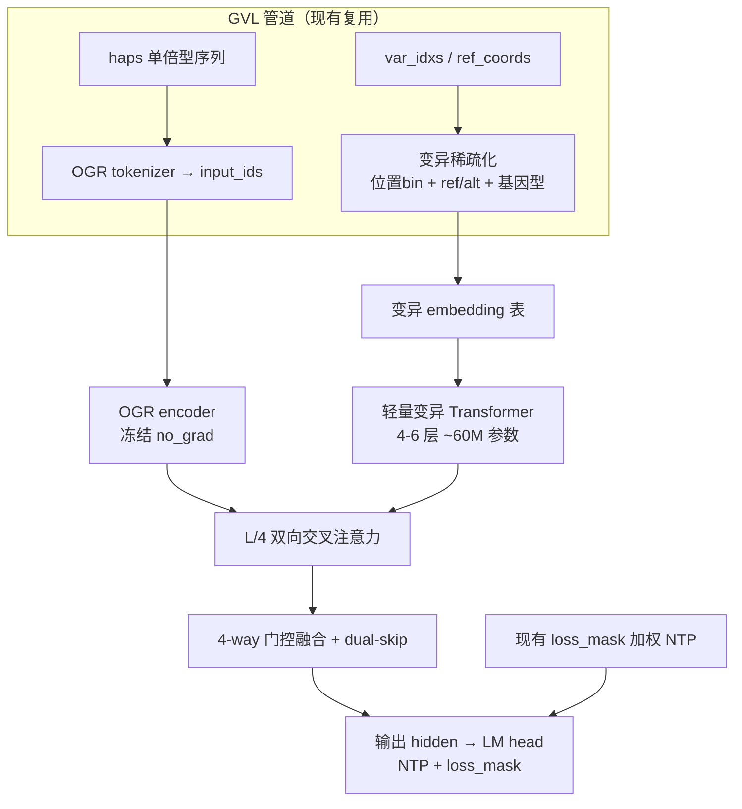
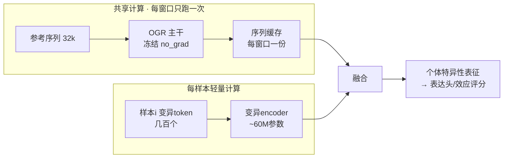

# 双 Encoder 变异注入方案（OGR 序列 + 轻量变异 Encoder）

> 状态：最终方案（2026-09-17）
> 背景：现有变异感知 CPT 基于**变异权重 loss_mask**（`VariantAwareCausalLM`，见 `script/src/model_head.py`）。
> 本方案改为**双 encoder 架构**：OGR 负责序列 embedding，单独的轻量变异 encoder 负责编码变异信息，通过 fusing 联合两种信息。

---

## 1. 核心思路

**训练目标不变**：仍是自监督 NTP（预测下一碱基），但输入从"参考序列"变为"个体单倍型序列 + 显式变异通道"，让 OGR 的 embedding 在序列理解之外，额外学会"等位基因差异的调控含义"。

**关键设计决策（已确认）**

| 决策项 | 选择 | 理由 |
|---|---|---|
| 变异通道信息粒度 | **位置 bin + ref/alt 碱基 + 基因型**（稀疏变异列表，Prime 风格） | 信息最完整；GVL 的 `ref_coords`/`haps` 已携带，无需重跑数据 |
| OGR 冻结策略 | **冻结 + 只训融合模块**（~60M 参数） | 单卡 24GB 可跑；先验证假设 |
| 融合机制 | **双向交叉注意力 + 4-way 门控 + dual-skip** | 复用应用4 `MultiModalPredictorFusion` 已验证模式（测试集 PCC 0.94） |
| 训练目标 | NTP + loss_mask（延续现状） | 平滑演进；与现有 CPT 代码兼容 |
| 融合注入位置 | **L/4 单点融合 + skip**（起步） | 成本低，直接复用应用4 代码；每层注入留作后续扩展 |

---

## 2. 架构详述

### 2.1 数据管道（Phase 1）— 零额外预处理成本

在 `script/src/variant_dataset.py` 的 `VariantCollator` 中新增输出：由 GVL 的 `var_idxs`/`ref_coords`/`haps` 构造**稀疏变异 token 列表**：

- 每个变异 token = `(位置 bin_id, ref_allele_id, alt_allele_id, genotype_id)`
- 位置 bin：`ref_coords // bin_size`（bin=64bp → 32k 窗口内 512 个 bin）
- 基因型：`haps` 与 `ref_coords` 比对（该位点碱基 ≠ ref 即 alt）；未 phase 沿用 ploidy=0 链，与现有 CPT 一致
- 复用 `loss_mask` 的 `ref_coords == -1`（padding）过滤逻辑

> **关键收益**：GVL 的 `ref_coords` 已经携带变异位置与等位信息，**不需要重跑 gvl.write**，`gvl_pipeline.py` 零改动。

### 2.2 轻量变异 Encoder（Phase 2）— 新文件 `script/src/variant_encoder.py`

- `VariantEmbedding`：embedding 表 = `[n_position_bins] + [5×5 碱基对(含N)] + [genotype: 0/1/2/缺失]`，concat 后过 `Linear(d_in → d_var)`
- `VariantTransformerEncoder`：参考 `rice_reg/.../model/encoder_transformer.py` 的 `TransformerLayer`（RoPE、LayerNorm、QKV），4-6 层、hidden 512-768、heads 8、FFN 4x
- 输出 `[B, n_vars, d_var]`，经 `Linear → d_og(1024)` 投影到 OGR 维度

### 2.3 融合注入（Phase 3）— 新文件 `script/src/fusion_block.py`

复用 `rice_reg/.../model/predictor_fusion.py` 的已验证组件：

1. **序列侧下采样**：`Conv1d(1024, 1024, kernel=5, stride=4, padding=2)` → 32k → 8k token
2. **双向交叉注意力**：`CrossAttentionSDPA`（变异→序列 + 序列→变异），在 L/4 处做
3. **4-way 门控融合**：`gate_mlp: Linear(4·d → 512) → GELU → Linear(512 → 4)`，softmax 加权 4 路（变异 self / 序列 self / cross 两向），带熵正则
4. **dual-skip**：变异投影 + 序列 hidden 经 `skip_gate` 融合后残差接回
5. 融合结果接回序列主干（残差），再走现有 LM head

### 2.4 模型装配与训练（Phase 4）

- 新类 `DualEncoderVariantLM`（`script/src/model_head.py`，**保留现有 `VariantAwareCausalLM` 作为对照基线 B**）
- OGR 冻结：复用 `predictor_fusion.py` 的 `_encode_dna` 模式（`torch.no_grad()` + `requires_grad=False`）
- 只训变异 encoder + 融合模块 + LM head（~60M 参数，单卡可跑）
- 输出 `(logits, variant_ce, background_ce)`，沿用现有 `Σ(w·CE)/Σw` 加权 NTP
- `trainer_utils.py` 的 `VariantCPTTrainer.compute_loss` 增加分支：检测双 encoder 架构，collate 输出 `variant_tokens` 传入
- 新 config `script/configs/train_32k_dual_encoder.yaml`（复制 `train_32k.yaml` + 新增 `variant_encoder:` 块）

### 2.5 双模式推理（训练时模态 dropout）

训练时以一定概率（如 30%）把变异通道置空（模态 dropout）：

- 70% 样本：输入 = 序列 + 变异 → 学变异感知
- 30% 样本：输入 = 序列（变异通道置空）→ 保序列-only 能力

**同一个 checkpoint 两种用法都成立**：
- `sequence-only 模式`：输入只有参考序列 → 兼容现有全部单序列下游（GenOmics、应用3）
- `variant-aware 模式`：输入 = 参考序列 + 变异 → 个体/变异类任务

---

## 3. 计算资源消耗对比（32k 窗口、batch=1、BF16）

| 资源项 | 全参 CPT | loss_mask CPT（现状） | loss_mask + LoRA | **双 encoder（冻结 OGR）** |
|---|---|---|---|---|
| 可训练参数 | ~1.39B | ~1.39B | ~1-2M | **~55-60M** |
| 主干前向 FLOPs | F | F | F | F（no_grad，省不掉） |
| 主干反向 FLOPs | ~2F | ~2F | ~2F | **≈0** |
| 每步总 FLOPs | ~3F | ~3F | ~3F | **~1.2F** |
| 权重+梯度+Adam 显存 | ~17GB | ~17GB | ~5GB | **~3GB** |
| 激活显存（grad_ckpt） | ~8-15GB | ~8-15GB | ~8-15GB | **~1-2GB**（仅融合点后） |
| **估算每卡峰值** | ~25GB+ | ~25GB+ | ~12-16GB | **~5-7GB** |
| GPU 需求 | 4× 32-80GB | 4× 32-80GB | 2-4× 24-32GB | **1× 24GB** |
| 相对训练时长 | 基准 | ~基准 | ~0.9× | **~0.4-0.5×** |
| 数据预处理 | gvl.write | gvl.write | gvl.write | **零新增** |

> 注意：若显存不再是瓶颈，多卡并行下吞吐可能接近全参微调——主干活（1.25B × 32k 前向）两者相同。双 encoder 的真实优势是"低门槛 + 省电 + 可加大 batch/并行度"。

**推理成本**：双 encoder 推理 = 主干全前向 + 变异 encoder 前向，比纯序列方案多约 5% 计算（窗口内数百变异 token）。

---

## 4. 应用价值：从"参考序列解读器"升级为"个体基因组解读器"

| 下游任务 | 单 encoder（现状） | 双 encoder |
|---|---|---|
| 单序列 → 表达/染色质（现有 GenOmics） | ✅ 输入仅参考序列 | ✅ 变异通道置空即可，行为不变 |
| **变异效应评估**（eQTL、TAC1 型位点扰动） | ❌ 需逐位点重造个体序列，成本爆炸 | ✅ **参考序列 + 目标位点变异**，直接评分 |
| **群体表达预测**（251 品种各自表达谱） | ❌ 序列侧无个体信息 | ✅ **参考序列共享一次 + 每品种轻量变异通道** |
| 跨品种泛化（P1/P4/P6→P7→P11） | ⚠️ 靠序列硬猜 | ✅ 显式基因型输入，泛化机制可解释 |

**核心洞察**：单 encoder 下，模型想区分两个品种的同一窗口，只能依赖参考序列里"本就不含的个体信息"——信息根本不在输入里。双 encoder 把这条信息通路显式打通。

**应用端不对称计算**（最划算处）：

251 个品种评估同一个窗口：序列侧只算 1 次（缓存），变异侧算 251 次轻量编码——比"每品种重跑一遍 1.25B × 32k 主干"便宜 2~3 个数量级。

---

## 5. 验证与对照实验（Phase 5）

训练三组对照（**同一数据/窗口/步数预算**）：

| 组 | 方案 | 目的 |
|---|---|---|
| **A** | 纯序列 CPT（无变异感知） | 背景 baseline |
| **B** | 现有 `VariantAwareCausalLM`（loss_mask 加权） | 当前方案 baseline |
| **C** | 双 encoder（本方案） | 目标方案 |

**评估分两步（回应假设质疑）**：

1. **变异表征质量**（内部指标）：
   - `variant_ce` 下降速度（变异区 CE）
   - 变异位点 hidden state 的**等位区分度**：同窗 ref/alt 样本表征的余弦距离/线性可分性
   - `background_ce` 平稳 = 无灾难性遗忘
2. **下游增益**（最终判据）：
   - 在基因表达预测任务上微调 A/B/C 三个 checkpoint，对比测试集 PCC（跨品种泛化，P7 验证 / P11 测试）
   - **只有 ② 显著提升才证明假设成立**；若 ① 好而 ② 平，说明 NTP 学到"碱基可预测性"而非"调控语义"，需换注入方式或加辅助损失

**补充验证**：用 `DatasetWithSites`（wt/mut 双单倍型）做单一变异扰动分析，验证变异通道是否聚焦真实功能位点。

---

## 6. 相关代码位置

**新增文件（`script/src/`）**：
- `variant_encoder.py` — 变异 embedding + 轻量 Transformer
- `fusion_block.py` — cross-attn + gate + skip 融合
- `model_head.py` 新增 `DualEncoderVariantLM`（保留现有 `VariantAwareCausalLM`）
- `configs/train_32k_dual_encoder.yaml`（新）

**修改文件**：
- `script/src/variant_dataset.py` — `VariantCollator` 增加变异 token 输出
- `script/src/trainer_utils.py` — `compute_loss` 分支支持变异 token

**复用参考（已验证代码）**：
- `rice_server/rice_reg/backend/rice_reg/core/model/predictor_fusion.py` — `CrossAttentionSDPA`、4-way `gate_mlp`、dual-skip、`_encode_dna` 冻结模式
- `rice_server/rice_reg/backend/rice_reg/core/model/encoder_transformer.py` — `TransformerLayer`、`RotaryEmbedding`、`apply_rope`
- 官方应用4：`ai4research/github/OneGenome-Rice/applications/4.gene_expression_prediction_based_on_multi_modal_data/model/`（ATAC 即"变异通道"的同构先例，实测 PCC 0.94）

---

## 7. 参考文献

| 文献 | 与双 encoder 的关系 |
|---|---|
| **Prime**（Zhou et al., Nature Machine Intelligence 2025） | 最直接对应：稀疏基因型编码 + latent bottleneck 变异嵌入注入 DNA 模型 |
| **Perceiver**（Jaegle et al., ICML 2021, arXiv:2103.03206） | 交叉注意力 latent bottleneck 注入范式（变异→序列注入的理论基础） |
| **FiLM**（Perez et al., AAAI 2018, arXiv:1709.07871） | 特征级线性调制，可选轻量注入备选 |
| **UKBioLM**（Liu et al., npj AI 2026；工作区 `github/UKBioLM/` 有源码） | 变异感知预训练同任务基线：单序列范式 + 变异加权/对比学习 |
| **GPN**（Benegas et al., ICML 2023） | 单序列 LM 变异效应评估方法参考 |
| **Enformer**（Avsec et al., Nature Methods 2021） | 序列→表达/变异卷积基线，下游对比强 baseline |
| **应用4 / MultiModalPredictorFusion**（OneGenome-Rice，实测 PCC 0.94） | **本项目已验证的融合架构**，直接作为融合模块模板 |
| **JEPA-DNA**（Bafna et al.；工作区 `github/JEPA-DNA/` 有源码） | 自监督序列表征替代范式，远期对照 |

> 注：已发表论文的确切卷期页码建议写作时用 Semantic Scholar/PubMed 二次核对。

---

## 8. 实施路线图

| 阶段 | 内容 | 产出 |
|---|---|---|
| P0 | 冒烟数据管道验证（现有 `test_8k.yaml`） | 变异 token 化正确性（`verify_gvl.py` 扩展） |
| P1 | 数据管道扩展：`VariantCollator` 输出变异 token | 稀疏变异 token 列表 |
| P2 | `variant_encoder.py` 轻量变异 encoder | ~60M 参数模块 |
| P3 | `fusion_block.py` 融合模块（复用应用4） | cross-attn + gate + skip |
| P4 | `DualEncoderVariantLM` 装配 + config + trainer 分支 | 可训练模型 |
| P5 | 冒烟：`bash run.sh configs/train_32k_dual_encoder.yaml model smoke` | 参数量/显存/loss 量级 |
| P6 | 三组对照训练（A/B/C） | checkpoint ×3 |
| P7 | 内部指标（variant_ce / 等位区分度）+ 下游表达 PCC | 假设判定 |
| P8（可选） | 解冻 OGR 末层 / 每层注入 / contrastive 辅助损失 | 效果上限探索 |

**对照实验 B（loss_mask 全参）必须跑**——它是判断双 encoder 增益的参照，且数据管道已就绪，成本只是 GPU 时间。
