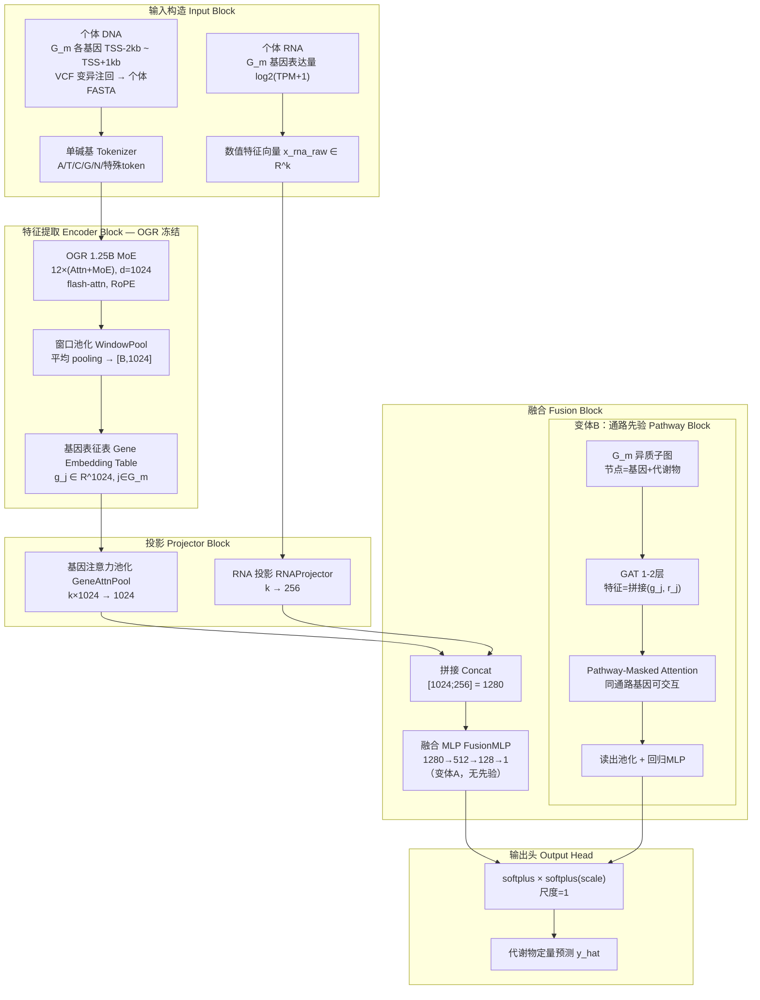
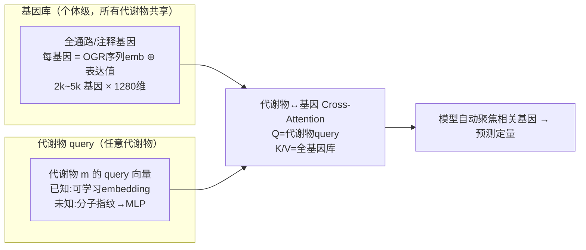

# 多组学→代谢物预测模型设计专篇（详细版）

> 版本：v0.2（2026-09-01）
> 本版重点：**模型架构的极致细化**（逐层结构、张量形状、初始化、超参），训练与应用部分摘要保留，完整训练/评估协议见 `doc/EXECUTION_PLAN.md`。
> 关联背景：OGR 1.25B MoE 基模（d=1024，12 层，RoPE base=50M，GQA 16Q/8KV，FlashAttention），GenOmics 的 softplus×scale 输出头 / squash 缩放 / CustomTrainer 等既有代码资产。

---

## 0. 设计目标与约束回顾

| 约束 | 含义 | 架构上的对策 |
|------|------|--------------|
| N≈200 个体（一期配对子集） | 强小样本 | OGR 冻结；可训练头 <3M；强 Dropout/早停 |
| 输入双模态异构 | DNA=序列、RNA=数值向量 | 分模态编码 → 统一向量空间 → 融合 |
| 代谢物多基因决定 | 非线性多基因协同 | G_m 基因集显式建模 +（变体B）通路先验结构 |
| 输出连续非负 | 定量回归 | softplus × softplus(scale)（复用 GenOmics 头） |
| 可解释（定位需求） | 需归因 | 池化注意权重、ISM 可微、G_m 结构可溯源 |
| **未知代谢物泛化（通用性核心）** | 预设 G_m 硬编码 → 新代谢物没文献先验就用不了 | 基因库 + 代谢物 query 检索（变体 C，二期主推） |

**总参数量（可训练）**：变体 A ≈ 0.7~0.8M；变体 B ≈ 2~3M（OGR 1.25B 冻结不计）。

---

## 1. 总体架构图



---

## 2. 逐模块详细规格

### 2.1 输入构造（每样本 = (个体 i, 代谢物 m)）

**基因集**：$G_m=\{\text{gene}_1,...,\text{gene}_k\}$，$k\in[20,80]$（构建规则见 §2.5，默认 k=50）。

**DNA 管道**：
1. 定位：基因 GFF → `TSS−2000bp ~ TSS+1000bp`（覆盖启动子 + 首外显子/UTR，突变影响表达最集中区域）；
2. 注回：个体 VCF（0/1/2 剂量）替换参考等位 → 个体双单倍型 FASTA（若 VCF 已分相则两 hap 各自成序列，未分相则用主导等位）；
3. Tokenize：单碱基词表（A/T/C/G/N + 特殊符，OGR 词表 128）；
4. 长度：L ≤ 8192（OGR 8k 上下文对齐）；超出基因体部分截断。

**RNA 管道**：$G_m$ 基因在个体 i 的表达值向量 → log2(TPM+1) →（统计量来自训练集）z-score → `x_rna_raw∈R^k`。

### 2.2 Encoder：OGR（冻结，`requires_grad=False`）

```
输入 token_ids: [B, L]（B = 个体×基因 对，pad 同一批）
→ embeddings [B, L, 1024]
→ 12 层 decoder block（每个内：GQA-Attn(16Q/8KV, RoPE) + MoE(8专家top-2, SwiGLU) + RMSNorm + 残差）
→ last_hidden_state [B, L, 1024]
→ WindowPool（平均）→ [B, 1024]   ← 含 PAD 位置 masked 平均
```

**Gene Embedding Table（一次离线缓存）**：
- 全项目基因集 $\mathcal{G}$（KEGG ∪ 已报道 ∪ WGCN，计划 1.5k~3k 个）一次性过 OGR，产出 `cache/gene_embeddings.npy [|G|, 1024]`；
- 运行时按 G_m 查表：`G_emb ∈ R^(k×1024)`；
- 收益：训练/应用 0 GPU 前向成本，202 样本 × 3k 基因 ≈ 2~4 GPU·天 一次性。

### 2.3 Projectors

**GeneAttnPool（基因注意力池化）**——把 k 个基因表征汇聚成 1 个 DNA 向量：

```
score_j = w_aᵀ·gelu(W_a·g_j)                    # W_a: 1024→64, w_a: 64→1
a = softmax(score) ∈ R^k
g_pool = Σ_j a_j · g_j ∈ R^1024                 # 注意力加权和
```

| 参数 | 形状 | 数量 |
|------|------|------|
| W_a | 1024×64 | 65,536 |
| w_a | 64×1 | 64 |
| viewer | — | 65,600 |

- 注：这个注意权重就是"哪些基因主导该代谢物预测"的第一层可解释性来源（H4）。

**RNAProjector（RNA 投影）**：

```
r = W_r·x_rna_raw + b_r                        # W_r: k×256
r = LayerNorm(256) → Dropout(0.3)
```

| 参数 | 形状 | 数量（k=50） |
|------|------|------|
| W_r | 50×256 | 12,800 |
| b_r | 256 | 256 |
| LayerNorm | 256×2 | 512 |
| 合计 | | ≈ 13.6k |

### 2.4 Fusion + Output Head

#### 变体 A：FusionMLP（无先验，H3 对照）

```
x = concat(g_pool, r) ∈ R^1280
h1 = Dropout(0.3)(SiLU(W1·x + b1))      # W1: 1280×512
h2 = Dropout(0.3)(SiLU(W2·h1 + b2))     # W2: 512×128
z  = W3·h2 + b3                          # W3: 128×1
y_hat = softplus(z) · softplus(scale)    # scale 每代谢物 1 标量，初始 0
```

| 参数 | 形状 | 数量 |
|------|------|------|
| W1/b1 | 1280×512 / 512 | 655,360 / 512 |
| W2/b2 | 512×128 / 128 | 65,536 / 128 |
| W3/b3 | 128×1 / 1 | 128 / 1 |
| scale | 1（每代谢物） | 1 |
| 合计 | | ≈ 721.7k |

**总可训练（变体A）= 65.6k(池化) + 13.6k(RNA) + 721.7k(MLP) ≈ 0.80M**

#### 变体 B：Pathway Head（先验网络注入，主推）

**构图（离线构建，个体无关）**：

```
节点: G_m 的 k 个基因 + 1 个代谢物节点 m
边:   KEGG 反应/调控关系（同通路基因互连）
      ∪ WGCN 强相关边（共表达 top 5%）
      ∪ 限速酶-代谢物直连
邻接: A ∈ R^((k+1)×(k+1))，对称加自环
```

**前向**：

```
节点特征初始化:
  H0[j] = concat(g_j, W_r2·x_rna_j)            # 1024 + 256 = 1280, j=1..k
  H0[m] = w_m（可学习代谢物 query，1280 维，初始由 G_m 代表性基因平均变体）
GAT 层 × (1~2)：H ← GAT(A, H)                  # GAT：1024+256→1024+256 → 1280
  （多头 4，concat out；若 2 层则中间 SiLU+Norm）
Pathway-Mask Attention：
  M_ij = 1 若 gene_i, gene_j 同通路，否则 0（代谢物节点与全部基因连通）
  Q=Linear(H), K=Linear(H), V=Linear(H)
  attn = softmax(QKᵀ/√d ⊙ M)                   # 硬掩码强制通路内交互
  H ← H + attn·V（残差）
读出：
  z = Linear(concat(pool(H_genes), H_m))        # 1024+256+256 = 1536 → 1
  y_hat = softplus(z)·softplus(scale)
```

| 参数 | 数量（估计） |
|------|------|
| GAT 1 层（4 头, 1280→1280） | ≈ 2.5M |
| Mask-Attn（Q/K/V/O: 1280↔1280） | ≈ 6.6M（若启用则超限，建议用共享/低秩 Q/K/V 或砍到 d=512） |
| 读出 MLP | ≈ 0.15M |
| **合计（GAT 仅1层 + 低秩Mask）** | **≈ 3.0M** |

> ⚠️ 变体B容量控制提示：若 Mask-Attn 用满宽 1280，参数飙到 ~9M，对 N≈200 过拟合风险高。**落地建议：GAT 1 层 + Mask-Attn 用 d_head=64 低秩 + 读出小 MLP，控制在 3M 内**；仍然过拟合就进一步砍 GAT 隐藏到 512。

#### 变体 C：基因库 × 代谢物 query 的注意力检索（通用方案，二期主推）

> 解决"代谢物必须预设基因集 G_m 才可建模"的通用性问题。完整设计见下方大节《从"预设基因集"转向"基因库 + 代谢物 query 的注意力检索"》。

**一句话**：不限定基因——每个个体提供**全基因库特征**（2k~5k 基因），代谢物用一个 **query 向量**（已知代谢物=学习 embedding；未知代谢物=Morgan 指纹投影），靠 `Cross-Attention(Q=query, K/V=基因库)` 让模型自动检索该代谢物相关基因，输出定量。

| 项 | 设计 |
|----|------|
| 基因库 | 个体 × 全通路/注释基因（2k~5k）→ [个体, 基因数, 1280]（OGR emb ⊕ 表达投影） |
| query | 每代谢物 64~128 维（已知:可学习；未知:指纹→MLP） |
| 检索 | Cross-Attn，latent 64~128（ISAB 压缩，参数不随基因库涨） |
| 输出 | latent + query → MLP → 代谢物量 |
| 参数 | ≈ 3~6M |
| 消融 | H5：C vs A/B + 未知代谢物留出 |

### 2.5 代谢物-基因集合 $G_m$ 构建（一期限定；二期软化为三层）

> ⚠️ 预设 G_m 决定了"哪些代谢物可建模"——它是**一期硬编码**，二期由变体 C（query 检索）替代为软先验。

| 来源 | 内容 | 优先级 | 实现 |
|------|------|--------|------|
| KEGG 水稻（ory） | 目标代谢物通路酶基因（限速酶优先） | 必选 | KEGG API / `keggrest` |
| 已报道 mQTL 基因 | 文献中该代谢物关联基因（罗杰系/华农 533 等） | 必选 | 文献表格人工整理 |
| 自建 WGCN | 404 根转录组 → WGCNA 模块中与该代谢物相关基因的邻居 | 可选 | WGCNA R 包 |
| TRIBE / 盐胁迫清单 | STG5、OsHKT 家族等 | 验证用 | 商连光 xlsx |

- k 值：默认 50，范围 20~80；k 过小缺信号，过大引噪声 + MLP 输入维度爆炸。

### 2.6 训练/推理张量形状全流

```
[训练 batch（变体A）]
DNA: 从 cache 查 G_emb [B, k, 1024]
RNA: [B, k]（同一 k，G_m 对齐条件下可批量）
→ g_pool [B,1024]；r [B,256]（RNAProjector）
→ x [B,1280] → MLP → [B,1] → softplus×scale → [B,1]
标签 y: [B,1]（z-score log-代谢）

[变体B]
H0: [B, k+1, 1280]；A: [k+1, k+1]（广播批量）
→ GAT→MaskAttn→读出 → [B,1]

[变体C（基因库×query检索）]
基因库: [B, N_gene, 1280]（全基因 OGRemb ⊕ 表达投影）
query:  [B, d_q]（代谢物m专用）
→ ISAB/CrossAttn(Q=query, K/V=基因库) → [B, num_latent, 128]
→ concat(latent_query, query) → MLP → [B,1]
```

---

## 2B. 从"预设基因集"转向"基因库 + 代谢物 query 的注意力检索"

> 本节回答通用性核心问题：**预测的输入不该是预设基因集，而应是全基因库 + 代谢物 query，让模型自己检索。**

### 2B.1 问题本质：预设 G_m 是死循环

当前（变体 A/B）的假设链：
```
代谢物 m → 需要知道其相关基因集 G_m → 否则无法建模
```
这条链让"预测一个从没研究过的代谢物"变成死局——新代谢物没有文献先验 → 没有 G_m → 建不了模型。这是硬编码先验的必然代价。

### 2B.2 根本解法：基因库 + 代谢物 query 的注意力检索

**思路反转**：不给代谢物限定基因，而是给模型全部基因，让模型"按代谢物检索"：



**核心机制**：`Cross-Attention(query=代谢物, key/value=基因库)` 让模型**自己学**"预测代谢物 m 时该看哪些基因"——把 G_m 从"人工预设"升级为"模型隐式检索"。

**三驾马车**：

| 组件 | 作用 | 解决什么问题 |
|------|------|--------------|
| **基因库编码** | 所有基因（不只目标代谢物）统一嵌入 | 输入不依赖代谢物 |
| **代谢物 query** | 每个代谢物一个表征向量（含未知代谢物投影） | 输出可任意指定，新代谢物=新 query |
| **Cross-Attention 检索** | Q=query, K/V=基因库 | 模型自动选基因，替代人工 G_m |

### 2B.3 泛化性链条（本设计的核心卖点）

```
推断时来了"未知代谢物 m*"：
  ① 给出它的表征：分子指纹（Morgan FP → MLP → query 向量）
     / 所在 KEGG 通路 embedding / 注释类别 one-hot
  ② 化学结构/通路相近的代谢物 → query 向量相近
     → Cross-Attention 检索到相近的基因集 → 预测可迁移
     （结构相似的代谢物共享调控基因）
  ③ 模型无需重训即可预测从未见过的代谢物
```

**化学空间连续性 → 基因检索连续性 → 预测连续性**，逻辑闭环。

### 2B.4 技术可行性（小样本下是否成立）

这是 **Perceiver 式架构**（Cross-attn 压缩 + 隐式检索），恰好适配：

| 项 | 设计 | 说明 |
|----|------|------|
| 基因库输入 | 按个体、全部 KEGG/注释基因（2k~5k） | 先取表达谱覆盖且注释通的基因子集 |
| Cross-Attn 压缩 | latent 64~128 个 | 先把 2k+ 基因压缩成 128 个隐向量（ISAB 思想） |
| query 维度 | 每代谢物 64~128 维 | 已知代谢物直接学 embedding；未知代谢物用指纹投影 |
| 参数量 | 约 3~6M（可控） | 只取决于 latent 数而非基因库大小→基因多参数不涨（Perceiver 核心） |
| 输出头 | latent + query → MLP → 单代谢物 | 逐代谢物独立推理或共享多任务 |

> **成立关键**：Cross-Attention 参数量只取决于 latent 数量（128），不随基因库大小（几千到四万）增长——通用性成本可控。

### 2B.5 数据端兜底（治标，仅冷启动辅助）

给"无先验基因集"的代谢物找 G_m 的可行方法（**注意仍是硬编码，只作冷启动**）：

| 方法 | 逻辑 | 局限 |
|------|------|------|
| KEGG 通路检索 | 知道代谢物身份→查通路→通路酶基因 | 只覆盖注释完善的 |
| 共表达分析 | 部分个体测了该代谢物→WGCNA找共响应基因→对未测个体预测 | 依赖部分测量 |
| 化学结构相似性迁移 | 指纹相似度→迁移近邻代谢物已建 G_m | 结构近≠调控近 |
| 公共 mGWAS 库 | 文献中该代谢物已报道关联基因 | 覆盖面有限 |

### 2B.6 方案演进（与一期关系）

| 阶段 | 用哪种 | 目的 |
|------|--------|------|
| **一期** | 变体 A/B（固定 G_m） | 验证"多组学建模能力"基线；结论限定"有先验基因集的代谢物" |
| **二期** | 变体 C（基因库+query 检索） | **论文方法学主创新点**，直接回答"通用性/未知代谢物" |
| 消融 | C vs A/B | "硬编码先验 vs 模型检索"本身就是研究问题 |
| 冷启动 | 数据端方法（2B.5） | 为一期深挖代谢物补 G_m、为二期 query 做初始化 |

| 类别 | 超参 | 初值 | 调参方向 |
|------|------|------|----------|
| 结构 | k（基因数/代谢物，变体A/B） | 50 | 20→100 扫描 |
| 结构 | 融合 MLP 宽度 | 512/128 | 若过拟合→256/64；欠拟合→1024 |
| 结构 | GAT 层数（变体B） | 1 | 2 需验证集确认 |
| 结构 | MaskAttn d_head（变体B） | 64（低秩） | 32~128 |
| 结构 | num_latent（变体C） | 128 | 64~256 |
| 结构 | query 维度（变体C） | 128 | 64~256 |
| 结构 | 基因库规模（变体C） | 2k~5k 基因 | 全注释基因（4万）二期试 |
| 正则 | Dropout | 0.3 | 0.2~0.5 |
| 正则 | weight_decay | 1e-2 | 1e-2~1e-1（小样本可加大） |
| 正则 | 早停 patience | 15 epoch | 10~30 |
| 优化 | 优化器 | AdamW | — |
| 优化 | lr | 3e-4 | 1e-4~1e-3 |
| 优化 | 调度 | cosine+warmup 5% | 或 step 衰减 |
| 优化 | batch | 全批量（≤64） | 32 或全量 |
| 训练 | max epoch | 100 | — |
| 训练 | 重复 | 5 seed × 品种划分 | 3~10 |
| 标签 | 变换 | log + z-score | 可试 rankGauss |
| 标签 | loss | MSE | Huber(δ=1) |

---

## 4. 训练要点（摘要）

- 两阶段：① 离线 embedding 缓存（一次）；② 头训练（分钟级/次）。
- 品种级划分（70/15/15）为命门；测试集指标只看一次。
- 防过拟合：冻结基模 + <1M~3M（变体C 3~6M）头 + Dropout/weight decay/早停 + **置换检验**（随机 y 必须远差于真实）。
- 变体 A 先跑通证明可行 → 变体 B（先验结构）→ 二期变体 C（query 检索，含未知代谢物留出实验）。
- 变体 C 额外：query 初始化可用冷启动 G_m 平均 embedding（2B.5）作为 warm start；未知代谢物=指纹投影需要额外监督对齐。

---

## 5. 应用要点（摘要）

- 新个体：`个体 DNA(注回)+ RNA` → 查表/在线提取 → 融合头 → 各代谢物预测值；
- 约束：RNA 限训练组织、代谢物限 G_m 覆盖、一期 RNA 用实测；
- 可解释：GeneAttnPool 权重 + MaskAttn 权重 + ISM/in silico 编辑 → 定位证据（H4）。

---

## 6. 复用资产

| 资产 | 复用点 |
|------|--------|
| OGR 基模 + 推理管线 | Encoder（`gene_expression_prediction/src/`） |
| VCF→个体序列注回 | `modeling_difference/preprocess_vcf/` |
| softplus×scale、squash、CustomTrainer、SwanLab | 输出头/训练基建 |
| TAC1 推理 notebook 模式 | In silico 应用演示 |

---

## 7. 开放问题（开工前确认）

1. 深挖代谢物 3~5 个的选定标准（遗传力 top ∩ 有已知基因 ∩ 有 mQTL 证据）；
2. k=50 默认是否 OK（需在 1 个代谢物上先做小扫描）；
3. 变体 B 是否与变体 A 同期实现（推荐 A→B 分步）；
4. OGR 输出是 last_hidden_state 还是倒数第 2 层（需 1 个代谢物快速实验对比）；
5. 双单倍型（分相 VCF）vs 主导等位（未分相）的输入策略（影响 token 数与实施复杂度）；
6. **变体 C 的 query 表征选型**：Morgan 指纹投影 vs 通路 embedding vs 类别 one-hot（需小实验对比，二期）;
7. **变体 C 的基因库规模**：先 2k~5k（注释+表达覆盖优先）还是直接全注释 4 万（Perceiver 可 support 但训练慢）；
8. **未知代谢物留出实验设置**：留出结构性异质的代谢物类（如全新道路）还是随机留出 10%~20% 代谢物（随机留出更能说明"可检索"，推荐先随机）。