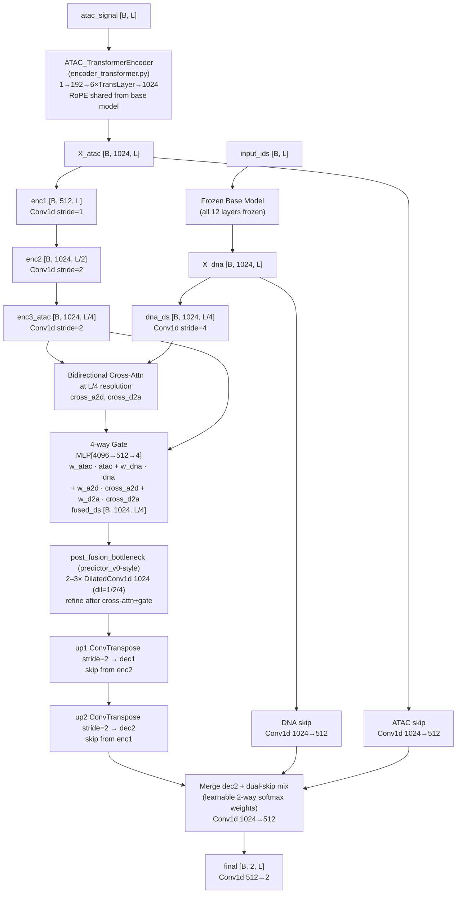

# Fusion Predictor Implementation Plan

## Architecture Data Flow



## Files to Create

### 1. `model/encoder_transformer.py`

New class `ATAC_TransformerEncoder(nn.Module)`:

- **Input**: `atac_signal [B, L]`
- **Output**: `[B, 1024, L]` (same shape convention as existing `ATAC_Encoder`)
- **Constructor args**: `d_low=192, n_layers=6, n_heads=4, ffn_mult=4, output_dim=1024, dropout=0.1`
- **Requires**: `base_model` passed to `__init__` to extract `rope_theta` and `max_position_embeddings`
- **Architecture**:
  - `atac_signal [B,L]` → `[B, L, 1]` → `Linear(1, d_low)` → `[B, L, d_low]`
  - Instantiate a fresh `MixtralRotaryEmbedding(dim=d_low//n_heads, max_position_embeddings=max_pos, base=rope_theta)` — same frequency scheme as base model, matching `position_ids`
  - 6× custom `TransformerLayer`: manual MHA with RoPE applied to Q/K, FFN, LayerNorm
  - `Linear(d_low, output_dim)` → `[B, L, 1024]`
  - `.transpose(1, 2)` → `[B, 1024, L]`
  - All params in `float32`
- Key: `position_ids` is passed from the predictor (same as DNA path) ensuring positional alignment
- **Expected params (approx)**: **~2.86M** (RoPE has no learned parameters)

### 2. `model/predictor_fusion.py`

New class `MultiModalPredictorFusion(nn.Module)`:

- **Constructor**: `(base_model, atac_encoder)` — same signature as all other predictors
- **`REQUIRED_DATASET_TYPE = "v0"`**
- **Base model**: fully frozen (all 12 layers, no last-layer unfreezing)
- **Modules**:
  - `dna_downsample`: `Conv1d(1024, 1024, kernel_size=5, stride=4, padding=2)` — strides X_dna from L to L/4
  - **ATAC conv pyramid (pre-fusion downsample + U-Net skips)**:
    - `enc1_atac`: `Conv1d(1024→512, k=3, stride=1, padding=1)` → `e1` (`[B, 512, L]`, used as skip)
    - `enc2_atac`: `Conv1d(512→1024, k=3, stride=2, padding=1)` → `e2` (`[B, 1024, L/2]`, used as skip)
    - `enc3_atac`: `Conv1d(1024→1024, k=3, stride=2, padding=1)` → `e3` (`[B, 1024, L/4]`, used as `X_atac_ds` for fusion)
  - **Cross-attention (recommended SDPA implementation)**:
    - `cross_a2d`: ATAC→DNA cross-attn at `L/4` (Q from `e3`, K/V from `dna_ds`)
    - `cross_d2a`: DNA→ATAC cross-attn at `L/4` (Q from `dna_ds`, K/V from `e3`)
    - Implementation choice:
      - Preferred: `F.scaled_dot_product_attention` (FlashAttention-enabled when available)
      - Acceptable: `nn.MultiheadAttention(1024, num_heads=8, batch_first=True)` for each direction
  - `gate_mlp`: `Linear(4096, 512) → GELU → Linear(512, 4) → Softmax` (4-way gate)
  - `post_fusion_bottleneck`: 2–3× dilated Conv1d (dilation=1,2,4) at L/4, **after** cross-attn + 4-way gate
  - `up1 / dec1 / up2 / dec2`: standard U-Net upsample with skips (as in predictor_v0)
  - `dna_skip_proj`: `Conv1d(1024, 512, kernel_size=1)` — projects full-res X_dna to 512
  - `atac_skip_proj`: `Conv1d(1024, 512, kernel_size=1)` — projects full-res X_atac to 512
  - `skip_gate` (**required**): learnable dual-skip weights using 2-way softmax, conditioned on decoder state, e.g. `Conv1d(512+512+512→2, k=1)` + softmax → `w_dna_skip, w_atac_skip`
  - `skip_mix`: `w_dna_skip * dna_skip + w_atac_skip * atac_skip` → `[B, 512, L]`
  - `skip_merge`: `Conv1d(1024, 512, kernel_size=3, padding=1)` — merges `concat([dec2, skip_mix])` → `[B, 512, L]`
  - `final`: same as predictor_v0 (`512→256→256→256→2` with dilated convs)
  - `scale`: learnable scalar
- **`_ensure_float32()`**: all decoder/encoder params cast to float32
- **`forward(input_ids, atac_signal, labels=None)`**:
  0. Build `position_ids = arange(L).expand(B, -1)` and pass it to both DNA RoPE path and ATAC encoder RoPE path (alignment requirement).
  1. `X_dna` from fully frozen base model (no grad) → transpose to `[B, 1024, L]`
  2. `X_atac` from `atac_encoder(atac_signal, position_ids)` → `[B, 1024, L]`
  3. `dna_ds = dna_downsample(X_dna)` → `[B, 1024, L/4]`
  4. `e1 = enc1_atac(X_atac)`, `e2 = enc2_atac(e1)`, `e3 = enc3_atac(e2)` → `e3` is `[B, 1024, L/4]`
  5. Prepare tensors for cross-attn at `L/4`:
     - If using SDPA: reshape to `[B, heads, L/4, d_head]`
     - If using `nn.MultiheadAttention`: transpose to `[B, L/4, 1024]`
     - **Gradient rule**: `dna_ds` should be treated as frozen K/V (computed from frozen base model); ATAC path is trainable.
  6. `cross_a2d = self.cross_a2d(e3, dna_ds, dna_ds)` (with attn dropout)
  7. `cross_d2a = self.cross_d2a(dna_ds, e3, e3)` (with attn dropout)
  8. Concat `[atac_self, dna_self, cross_a2d, cross_d2a]` → `[B, L/4, 4096]` → gate MLP → 4 weights
  9. `fused_ds = w0*e3 + w1*dna_ds + w2*cross_a2d + w3*cross_d2a` → transpose back to `[B, 1024, L/4]`
  10. `post_fusion_bottleneck(fused_ds)` → up1 → dec1 (skip e2) → up2 → dec2 (skip e1)
  11. `dna_skip = dna_skip_proj(X_dna)` → `[B, 512, L]`; `atac_skip = atac_skip_proj(X_atac)` → `[B, 512, L]`
  12. Compute dual-skip weights with 2-way softmax conditioned on `dec2`: `w_dna_skip, w_atac_skip`
  13. `skip_mix = w_dna_skip * dna_skip + w_atac_skip * atac_skip` → `[B, 512, L]`
  14. concat `dec2` + `skip_mix` → `skip_merge` → `[B, 512, L]`
  15. `final(merged)` → `softplus * softplus(scale)` → `[B, 2, L]`
  16. MSE loss if labels provided
  - Size mismatch tolerance with `F.interpolate(..., mode="nearest")` identical to predictor_v0

## Files to Modify

### 3. `model/pipeline.py`

- **Import**: add `from model.encoder_transformer import ATAC_TransformerEncoder` and `from model.predictor_fusion import MultiModalPredictorFusion`
- **`build_multimodal_model`**: add `elif ptype == "fusion":` branch **before** the default `ATAC_Encoder` construction:

```python
elif ptype == "fusion":
    atac_encoder = ATAC_TransformerEncoder(base_model=base_model, output_dim=1024)
    model = MultiModalPredictorFusion(base_model, atac_encoder)
```

- Update the error message in the `else` clause to include `'fusion'`

### 4. Config files — add `fusion` type annotation

- `config.example/training.yaml`: add comment under `predictor: type: v0` block
- `config.example/infer.yaml`: add comment in the predictor type comment block
- `config.example/experiment.yaml`: add comment in the predictor block

Example comment to add in each:

```yaml
# predictor:
#   type: fusion   # bidirectional cross-attn at L/4 + U-Net + post-fusion bottleneck
#                  # + full-res dual-skip (DNA+ATAC) with learnable weights
#                  # (uses ATAC_TransformerEncoder + MultiModalPredictorFusion)
```

### 5. `AGENTS.md`

Add two rows to the module table under `model/`:

```
│ ├── encoder_transformer.py  # ATAC_TransformerEncoder: Transformer (d=192, 6L) → Linear→1024; RoPE shared with base model
│ ├── predictor_fusion.py     # MultiModalPredictorFusion: bidir cross-attn L/4 + 4-way gate + U-Net + DNA skip
```

And add `fusion` to the `predictor.type` list in the training configuration section.

## Key Constraints / Notes

- `atac_encoder_output_dim` in YAML is ignored for `type: fusion`; encoder always outputs 1024 to match `hidden_size`
- `REQUIRED_DATASET_TYPE = "v0"` — works with default dataset, no new dataset needed
- `dna_downsample` (stride=4 Conv1d) is **trainable** so it learns to summarize DNA context for cross-attn; it uses float32
- `F.scaled_dot_product_attention` (PyTorch 2.0+ SDPA) is recommended in implementation for Flash Attention support
- `attn_dropout=0.1` applied to both cross-attn modules during training
- Gate MLP bias init: `[−0.2, +0.3, 0.0, 0.0]` for `[w_atac, w_dna, w_a2d, w_d2a]`
- All non-base-model parameters (ATAC encoder, fusion, decoder) in `float32`; base model in `bfloat16`
- **Expected trainable params (approx)**: **~52M** (excludes frozen base model; see `model/fusion.md`)
- **Expected compute (approx)**: **~96 TFLOPs/step** at `L=32000`, batch=1 (see `model/fusion.md`)
- **Implementation gotcha**: ensure `position_ids` is shared between DNA and ATAC RoPE usage; otherwise cross-attn alignment degrades.
- **YAML (`predictor:` block)**: `fusion_gate_entropy_frac` and `skip_gate_entropy_frac` (default `0.0`) — entropy regularization as a fraction of MSE using normalized entropy \(H/\log K\): `loss = mse - mse.detach() * (fusion_frac * H4_norm + skip_frac * H2_norm)`; set `0` to disable regularization (entropies are still logged in training CSV).

