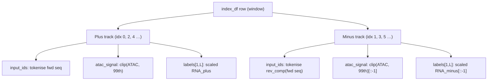

# Strand-Split Dataset Plan

## Overview

Rewrite `model/dataset_strand.py` (two strand-specific samples per window, `[1, L]` labels,
shared base class). Add `model/predictor_ss.py` (1-channel head with `REQUIRED_DATASET_TYPE`
class attribute). Wire a new `dataset_type` YAML key through `pipeline.py`, `inference.py`,
and `run.py`:

- `dataset_type: v0` (default) — existing two-strand-per-window behaviour, any predictor type.
- `dataset_type: strand` — new strand-split dataset + enforces `predictor.type: ss`.

---

## Files to change

| File | Change |
|------|--------|
| `model/dataset_strand.py` | Full rewrite |
| `model/predictor_ss.py` | New — 1-channel output head |
| `model/pipeline.py` | Register `ss`; `dataset_type` helpers; dynamic dataset selection |
| `inference.py` | Read `dataset_type`; pick dataset class; strand-split inference loop |
| `run.py` | Forward `dataset_type` in `run_inference_step` inference config |
| `config.example/experiment.yaml` | Add `dataset_type` comment |
| `config.example/training.yaml` | Add `dataset_type` comment |
| `config.example/infer.yaml` | Add `dataset_type` comment |
| `AGENTS.md` | Document `dataset_type`, `predictor_ss`, `dataset_strand` |
| `README.md` | Note `dataset.py` legacy; `dataset_strand.py` canonical |
| `training.py` | Add `ss` to docstring predictor list |
| `model/modularization.md` | Add Phase 3 section and process-log row |

---

## Todo checklist

- [x] `base-class` — Add `_RC_TABLE`, `_reverse_complement`, `_process_signal`, `_GenomicDatasetBase` (with `_load_raw` and `_build_strand_tensors`) to `model/dataset_strand.py`
- [x] `lazy-dataset` — Implement `LazyGenomicDataset` (doubled len, `idx//2` row, `idx%2` strand, `labels [1,L]`, null-sample fallback `[1,L]`)
- [x] `inference-dataset` — Implement `InferenceDataset` (doubled len; returns `strand`, `position`, `sequence`, `track_mean`, `batch_name`)
- [x] `predictor-ss` — Create `model/predictor_ss.py` with `REQUIRED_DATASET_TYPE = "strand"` class attr and `nn.Conv1d(256, 1, kernel_size=1)` final layer
- [x] `pipeline-update` — Update `model/pipeline.py`: register `ss`, add `_resolve_dataset_type` / `_validate_dataset_type_match` helpers, dynamic dataset selection in `run_training`
- [x] `inference-update` — Update `inference.py`: read `dataset_type`, pick dataset class, validate, add strand-split inference loop branch
- [x] `run-update` — Update `run.py` `run_inference_step`: forward `dataset_type` into `infer_cfg`
- [x] `config-update` — Add `dataset_type` comment to `experiment.yaml`, `training.yaml`, `infer.yaml`
- [x] `docs` — Update `AGENTS.md`, `README.md`, `training.py` docstring, `model/modularization.md`
- [ ] **(maybe)** `h2-strand` — Make H2/H2B predictors also accept strand-specific data (`dataset_type: strand`; loss/head shapes TBD)

---

## 1. `model/dataset_strand.py` — full rewrite

### Design: doubled dataset with shared base

Each index row yields **2** samples:

```
row_idx  = idx // 2
is_minus = bool(idx % 2)   # 0 → plus, 1 → minus
```



### Module-level helpers

```python
_RC_TABLE = str.maketrans("ACGTNacgtn", "TGCANtgcan")

def _reverse_complement(seq: str) -> str:
    return seq.translate(_RC_TABLE)[::-1]

def _process_signal(raw_vals, target_len) -> np.ndarray:  # keep existing
    ...
```

### Shared base class `_GenomicDatasetBase`

```python
class _GenomicDatasetBase:
    TARGET_LEN = 32000

    def __init__(self, index_df, tokenizer, strict_bw_open=False):
        # open all BigWig handles; strict_bw_open=False → warn on error, else raise
        ...

    def _get_fasta(self, path): ...
    def close(self): ...

    def _load_raw(self, row):
        """Returns (seq_fwd, atac_clipped, plus_vals, minus_vals) — all length TARGET_LEN.
        ATAC clip percentile is computed before reversing (reversing doesn't change values)."""
        ...

    def _build_strand_tensors(self, seq_fwd, atac_clipped, plus_vals, minus_vals,
                              is_minus, row, max_length):
        """Returns {input_ids, atac_signal [bfloat16], labels [float32, 1×L]}."""
        if is_minus:
            seq   = _reverse_complement(seq_fwd)
            atac  = atac_clipped[::-1].copy()
            rna   = minus_vals[::-1].copy()
            tmean = np.array([row["track_mean_minus"]])
        else:
            seq   = seq_fwd
            atac  = atac_clipped
            rna   = plus_vals
            tmean = np.array([row["track_mean_plus"]])
        scaled = targets_scaling(rna[np.newaxis, :], tmean)   # shape [1, L]
        enc = tokenizer(seq, padding="max_length", max_length=max_length,
                        truncation=True, return_tensors="pt", return_attention_mask=False)
        return {
            "input_ids":   enc["input_ids"].squeeze(0),
            "atac_signal": torch.tensor(atac, dtype=torch.bfloat16),
            "labels":      torch.tensor(scaled, dtype=torch.float32),
        }
```

### `LazyGenomicDataset(Dataset, _GenomicDatasetBase)`

- `__len__` → `2 * len(index_df)`
- `__getitem__`: calls `_build_strand_tensors`; on exception returns null sample:
  ```python
  {"input_ids": ..., "atac_signal": zeros(L, bfloat16), "labels": zeros(1, L, float32)}
  ```

### `InferenceDataset(_GenomicDatasetBase)`

- `__init__`: calls base with `strict_bw_open=True`
- `__len__` → `2 * len(df)`
- `__getitem__`: calls `_build_strand_tensors`, then appends:
  ```python
  {
      "strand":     "+" or "-",
      "position":   (chrom, int(start), int(end)),   # original genomic coords always
      "sequence":   seq,          # string fed to model (rev-comp for minus)
      "track_mean": float,        # track_mean_plus or track_mean_minus
      "batch_name": str,          # batch_name_plus or batch_name_minus
  }
  ```

---

## 2. `model/predictor_ss.py` — 1-channel output head

Copy of `predictor_v0.py` with three changes:

- Class renamed `MultiModalPredictorSS`
- Class attribute `REQUIRED_DATASET_TYPE = "strand"` — consumed by the validation helper
- Final Conv1d channels: `2` → `1`

```python
# predictor_v0.py
nn.Conv1d(256, 2, kernel_size=1)

# predictor_ss.py
nn.Conv1d(256, 1, kernel_size=1)
```

`forward` is unchanged; `F.mse_loss(logits, labels)` works for `[B, 1, L]`.

---

## 3. `model/pipeline.py` — dataset_type wiring

### New helpers

```python
def _resolve_dataset_type(cfg: dict) -> str:
    """Return 'v0' or 'strand'. Raises on unknown values."""
    raw = cfg.get("dataset_type", "v0")
    s = str(raw).strip().lower()
    if s not in ("v0", "strand"):
        raise ValueError(f"dataset_type must be 'v0' or 'strand', got {raw!r}")
    return s

def _validate_dataset_type_match(dataset_type: str, ptype: str, model_cls) -> None:
    """Raise if dataset_type and predictor.REQUIRED_DATASET_TYPE disagree."""
    required = getattr(model_cls, "REQUIRED_DATASET_TYPE", "v0")
    if dataset_type != required:
        raise ValueError(
            f"predictor.type={ptype!r} requires dataset_type={required!r}, "
            f"but config has dataset_type={dataset_type!r}"
        )
```

### `build_multimodal_model` — add `ss` branch

```python
from model.predictor_ss import MultiModalPredictorSS

elif ptype == "ss":
    model = MultiModalPredictorSS(base_model, atac_encoder)
```

### `run_training` — dynamic dataset selection

```python
dataset_type = _resolve_dataset_type(cfg)
# ... after model is built:
_validate_dataset_type_match(dataset_type, ptype, type(model))

if dataset_type == "strand":
    from model.dataset_strand import LazyGenomicDataset
else:
    from model.dataset import LazyGenomicDataset

train_dataset = LazyGenomicDataset(train_index_df, tokenizer, max_length=32000)
```

---

## 4. `inference.py` — dataset_type wiring

### Dataset selection and validation

```python
dataset_type = cfg.get("dataset_type", "v0")

if dataset_type == "strand":
    from model.dataset_strand import InferenceDataset
else:
    from model.dataset import InferenceDataset

# after model is built:
from model.pipeline import _validate_dataset_type_match
_validate_dataset_type_match(dataset_type, ptype, type(model))
```

### Inference loop — strand-split branch

The inference loop must branch on `dataset_type` because sample keys and logits shape differ:

```python
# dataset_type == "strand" branch
for sample, logits in zip(samples, logits_b):
    L = len(sample["sequence"])
    tm = np.array([sample["track_mean"]])
    strand = sample["strand"]

    pred = predictions_scaling(logits[0, :L].reshape(1, -1), tm).reshape(-1)
    true = predictions_scaling(sample["labels"][0, :L].numpy().reshape(1, -1), tm).reshape(-1)

    # Minus predictions are in rev-comp space; reverse back to genomic orientation.
    if strand == "-":
        pred = pred[::-1].copy()
        true = true[::-1].copy()

    chrom, start_pos, end_pos = sample["position"]
    row_data = {
        "chromosome": chrom, "start": start_pos, "end": end_pos,
        "sequence": sample["sequence"],
        "true_expression": true,
        "predicted_expression": pred,
    }
    if strand == "+":
        plus_results.setdefault(sample["batch_name"], []).append(row_data)
    else:
        minus_results.setdefault(sample["batch_name"], []).append(row_data)

# dataset_type == "v0" branch (existing code, unchanged)
for sample, logits in zip(samples, logits_b):
    ...
```

---

## 5. `run.py` — forward `dataset_type`

In `run_inference_step`, add one line to `infer_cfg`:

```python
infer_cfg["dataset_type"] = cfg.get("dataset_type", "v0")
```

---

## 6. Config examples — add `dataset_type`

In `config.example/experiment.yaml` and `config.example/training.yaml` (inside the `predictor:` block):

```yaml
predictor:
  type: v0   # or 'ss' for strand-split (requires dataset_type: strand below)

# dataset_type: v0      # default — two-strand labels per window, any predictor
# dataset_type: strand  # strand-split dataset; requires predictor.type: ss
```

In `config.example/infer.yaml`:

```yaml
# dataset_type: v0      # default — original InferenceDataset
# dataset_type: strand  # strand-split InferenceDataset; requires predictor.type: ss
```

---

## 7. Final document updates

- **`AGENTS.md`** — add `model/predictor_ss.py`, `model/dataset_strand.py` to the structure table; document `dataset_type` key in the config section; note `REQUIRED_DATASET_TYPE` validation mechanism
- **`README.md`** — update the Legacy code section to note `dataset.py` is a legacy shim; `dataset_strand.py` is canonical
- **`training.py`** — add `ss` to the predictor type list in the docstring
- **`model/modularization.md`** — add Phase 3 section (strand-split dataset, predictor_ss, dataset_type wiring) and process-log row
